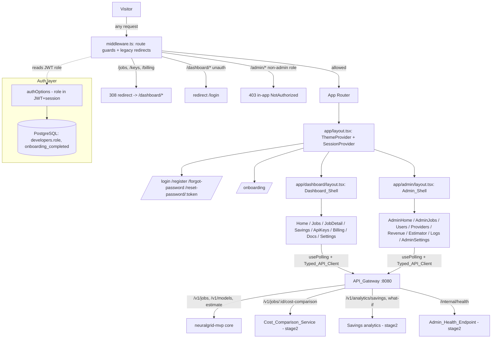

# Design Document: Dashboard Redesign

## Overview

This feature rebuilds NeuralGrid's Dashboard (`dashboard/`, Next.js 14 App Router) into the two-surface product the `NeuralGrid_Dashboard_PRD.md` describes: a redesigned **User Dashboard** under `/dashboard/*` (Home, Jobs, Job Detail, Savings, API Keys, Billing, Docs, Settings, plus Onboarding and auth pages) and a net-new **Admin Dashboard** under `/admin/*` (Home, Jobs, Users, Providers, Revenue, Estimator, Logs, Settings). Every existing page (`/login`, `/jobs`, `/keys`, `/billing`) is rebuilt on **shadcn/ui** with **next-themes** dark mode and **recharts** charts, and the three bare legacy routes become permanent redirects to their `/dashboard/*` equivalents.

The dashboard is a **UI layer** over two existing backends: the `neuralgrid-mvp` API_Gateway (`/v1/jobs`, `/v1/models`, estimate) and the `neuralgrid-stage2` additions (`Cost_Comparison_Service` at `GET /v1/jobs/:id/cost-comparison`, savings analytics, `Admin_Health_Endpoint` at `GET /internal/health`, `Estimator_Accuracy_Record`). This document specifies how the UI consumes those endpoints and their data shapes; it does not re-specify backend calculation logic. Where the PRD needs data the current backend does not return, this document flags it as an explicit **backend prerequisite/gap** (see [Backend Prerequisites and Gaps](#backend-prerequisites-and-gaps)) rather than assuming it exists.

**Key design decisions:**

- **Route reorg via real folders, legacy redirects via `next.config.js`.** The `/dashboard/*` and `/admin/*` namespaces are plain App Router folders (`app/dashboard/...`, `app/admin/...`), each with its own `layout.tsx` that renders its shell. The three legacy routes (`/jobs`, `/keys`, `/billing`) are declared as permanent redirects in `next.config.js#redirects()` — this is the one place where the redirect is truly unconditional (Requirement 2.2): it fires at the framework routing layer before any target page renders, so it cannot depend on whether `/dashboard/*` loads.
- **Two structurally separate shells.** `Dashboard_Shell` (`app/dashboard/layout.tsx`) and `Admin_Shell` (`app/admin/layout.tsx`) are independent layout components with independent navigation. They share only leaf presentational primitives (shadcn components, shared badges), never navigation state (Requirement 17.4).
- **Route guards in middleware, reading the JWT role claim.** A single `dashboard/src/middleware.ts` enforces `Dashboard_Route_Guard` (unauthenticated `/dashboard/*` or `/onboarding` → redirect `/login`) and `Admin_Route_Guard` (`/admin/*` with a non-`admin` role → 403). Reading the role from the NextAuth JWT avoids a per-request DB round trip (Requirement 21.2).
- **Admin role is a real, enforced concept — new migration + session claim.** A new migration adds a `role` column to `developers` (default `developer`), NextAuth callbacks carry `role` into both JWT and session, and the middleware enforces it. This is in-scope prerequisite work (Requirement 21.1–21.2). Note this **supersedes** the `is_admin BOOLEAN` flag sketched in `neuralgrid-stage2` design — see [Data Models](#data-models).
- **One polling primitive, no WebSockets.** A single `usePolling` hook drives every live surface at its required cadence (5s / 10s / 30s). No WebSocket dependency is introduced (Requirement 1.5). This diverges from `neuralgrid-stage2`'s `Job_Event_Channel` pub/sub note — this dashboard polls `GET /v1/jobs/:id` instead of subscribing, keeping the client dependency-free per the PRD's "No WebSockets in MVP" constraint.
- **Shared component library built once.** Badges, cost/savings displays, empty states, and skeletons live in `dashboard/src/components/shared/` and are imported by both shells (Requirement 3.6). All monetary rendering funnels through one `Cost_Display` / `formatCost` path (Requirement 1.6).
- **Existing pages are rebuilt, not wrapped.** The current `/login`, `/jobs`, `/keys`, `/billing` pages use inline styles and mock data. They are migrated to shadcn/ui at their new `/dashboard/*` (or same, for login) routes; the old files are reduced to redirect stubs (or removed in favor of `next.config.js` redirects).

## Architecture



**What changes vs the current app:**
- New `middleware.ts` centralizes guards and legacy redirects (none exist today).
- `app/layout.tsx` gains `ThemeProvider` (next-themes) wrapping the existing `SessionProvider`.
- `authOptions` gains `role` and `onboarding_completed` in the JWT and session callbacks.
- Two new route-group layouts render the shells; page components move under them.
- `lib/api.ts` grows into the full `Typed_API_Client` (401/429/5xx normalization + all endpoints).

## Components and Interfaces

### File layout

```
dashboard/src/
  middleware.ts                         # Dashboard_Route_Guard + Admin_Route_Guard
  app/
    layout.tsx                          # root: ThemeProvider + SessionProvider (edit)
    providers.tsx                       # add ThemeProvider (edit)
    page.tsx                            # landing (unchanged render); authed redirect target -> /dashboard (edit 1 line)
    login/page.tsx                      # rebuilt on shadcn (migrate)
    register/page.tsx                   # new
    forgot-password/page.tsx            # new
    reset-password/[token]/page.tsx     # new
    onboarding/page.tsx                 # new (guarded, 3-step client flow)
    jobs/page.tsx                       # -> redirect stub (or removed; handled by next.config redirect)
    keys/page.tsx                       # -> redirect stub
    billing/page.tsx                    # -> redirect stub
    dashboard/
      layout.tsx                        # Dashboard_Shell (Sidebar + Top_Bar + main)
      page.tsx                          # Home_Page
      jobs/page.tsx                     # Jobs_Page
      jobs/[id]/page.tsx                # Job_Detail_Page
      savings/page.tsx                  # Savings_Page
      api-keys/page.tsx                 # Api_Keys_Page (migrate from /keys)
      billing/page.tsx                  # Billing_Page (migrate from /billing)
      docs/page.tsx                     # Docs_Page
      settings/page.tsx                 # Settings_Page
    admin/
      layout.tsx                        # Admin_Shell (admin nav)
      forbidden/page.tsx                # in-app 403 NotAuthorized target
      page.tsx                          # Admin_Home_Page
      jobs/page.tsx                     # Admin_Jobs_Page
      users/page.tsx                    # Admin_Users_Page
      providers/page.tsx                # Admin_Providers_Page
      billing/page.tsx                  # Admin_Revenue_Page
      estimator/page.tsx                # Admin_Estimator_Page
      logs/page.tsx                     # Admin_Logs_Page
      settings/page.tsx                 # Admin_Settings_Page
  components/
    shared/
      JobStatusBadge.tsx
      TierBadge.tsx
      ProviderBadge.tsx
      CostDisplay.tsx                   # exports formatCost() pure fn + component
      SavingsPill.tsx                   # exports computeSavingsPct() + shouldRenderSavings()
      EmptyState.tsx
      SkeletonScreen.tsx
    dashboard/                          # Dashboard_Shell parts
      Sidebar.tsx  TopBar.tsx  GlobalSearch.tsx  NotificationBell.tsx
    admin/                              # Admin_Shell parts
      AdminSidebar.tsx  SystemStatusBar.tsx  NotAuthorized.tsx
  lib/
    api.ts                              # Typed_API_Client (extend existing)
    auth.ts                             # + role, onboarding_completed claims (edit)
    usePolling.ts                       # polling hook (5s/10s/30s)
    format.ts                           # formatCost, thresholds, redirect map (pure fns)
    types.ts                            # UI-facing response types (mirror @neuralgrid/shared)
  components.json                       # shadcn/ui config (new)
scripts/migrations/
  002_add_developer_role.sql            # new: role + onboarding_completed columns
```

### Foundation / Architecture

#### `next.config.js` — legacy redirects (Requirement 2.2)

```javascript
async redirects() {
  return [
    { source: '/jobs',    destination: '/dashboard/jobs',     permanent: true },
    { source: '/keys',    destination: '/dashboard/api-keys',  permanent: true },
    { source: '/billing', destination: '/dashboard/billing',   permanent: true },
  ];
}
```

Declaring redirects here (rather than in a page component) makes them unconditional (308) at the routing layer — they never depend on the target rendering. The mapping itself (`/keys` → `/dashboard/api-keys`, not `/dashboard/keys`) is also expressed as a pure function `legacyRedirectTarget()` in `lib/format.ts` so it can be property-tested (see Property 7) and reused if a page-level stub is ever needed.

#### `shadcn/ui` + `next-themes` + `recharts` setup (Requirement 1.2, 1.3, 1.4)

- **`components.json`** created via `npx shadcn-ui@latest init` with: style `default`, base color `slate`, CSS variables `true`, Tailwind config pointed at the existing `tailwind.config.js`, alias `@/components` / `@/lib`.
- **CSS-variable theming**: `globals.css` gains the shadcn `:root` / `.dark` variable blocks (`--background`, `--foreground`, `--primary`, `--muted`, `--destructive`, etc.). The existing `ng-*` brand colors and gradients in `tailwind.config.js` are preserved (the landing page depends on them); shadcn variables are added alongside, and `darkMode: ['class']` is added so `next-themes` toggles `.dark` on `<html>`.
- **`Theme_Provider`** wraps the app in the root layout from initial load (Requirement 1.3) — see `providers.tsx` below. `suppressHydrationWarning` is added to `<html>` to accommodate `next-themes` class injection.
- **`recharts`** is used for all three charts (Home monthly spend bars, Savings cumulative line, Admin revenue line). No other charting library is introduced.
- Dependencies added to `dashboard/package.json`: `next-themes`, `recharts`, `class-variance-authority`, `clsx`, `tailwind-merge`, `lucide-react`, and the Radix primitives shadcn pulls in per component. shadcn components are generated into `components/ui/` (not hand-authored).

#### `providers.tsx` (edit)

```typescript
'use client';
import { SessionProvider } from 'next-auth/react';
import { ThemeProvider } from 'next-themes';

export function Providers({ children }: { children: ReactNode }) {
  return (
    <SessionProvider>
      <ThemeProvider attribute="class" defaultTheme="system" enableSystem>
        {children}
      </ThemeProvider>
    </SessionProvider>
  );
}
```

#### Migration approach for the 4 existing plain-Tailwind/inline-style pages

| Page | Today | Target |
|---|---|---|
| `/login` | inline-style client form, `router.push('/jobs')` | shadcn `Form`/`Input`/`Button` at `/login`; success → `/dashboard` (Req 6.1). Same `signIn('credentials', { redirect: false })` call retained. |
| `/jobs` | server page + `JobsClient` (mock fallback, inline table) | rebuilt as `Jobs_Page` at `/dashboard/jobs` with shadcn `Table`, filter bar, cursor pagination; `/jobs` becomes a redirect (Req 2.2). |
| `/keys` | client page, inline table, mock keys | rebuilt as `Api_Keys_Page` at `/dashboard/api-keys` with shadcn `Table`/`Dialog`/`AlertDialog`; `/keys` redirects. |
| `/billing` | server page, inline tables, `RUNPOD_A100_HOURLY_RATE` local calc | rebuilt as `Billing_Page` at `/dashboard/billing`; savings arithmetic moves to backend analytics endpoints, page renders `Cost_Display`; `/billing` redirects. |

The migration preserves each page's existing auth pattern (`getServerSession(authOptions)` server-side, `useSession` client-side) and swaps mock data for `Typed_API_Client` calls with graceful empty/skeleton states.

#### `Dashboard_Shell` — `app/dashboard/layout.tsx` (Requirement 8)

Server component that renders `Sidebar` (240px fixed at/above `md`, drawer below — shadcn `Sheet`), `Top_Bar` (page title + `Global_Search` + `Notification_Bell`), and a `<main>` content slot. Sidebar contents per Requirement 8.2: logo/wordmark, nav links (Home, Jobs, Savings, API Keys, Billing, Docs), a bottom upgrade CTA shown only for free-tier developers, and avatar/email/plan badge at the very bottom with a settings gear. `Top_Bar` never duplicates a Sidebar link (Requirement 8.3).

```typescript
// Sidebar nav is data-driven so Top_Bar can derive the title without duplicating links.
export interface NavItem { label: string; href: string; icon: LucideIcon; }
export const DASHBOARD_NAV: NavItem[] = [ /* Home, Jobs, Savings, API Keys, Billing, Docs */ ];
```

#### `Admin_Shell` — `app/admin/layout.tsx` (Requirement 17.4)

Structurally separate layout with its own `AdminSidebar` (admin nav: Home, Jobs, Users, Providers, Revenue, Estimator, Logs, Settings) and `SystemStatusBar`. Shares no navigation state or context with `Dashboard_Shell`. Performs a defense-in-depth server-side role check in addition to the middleware guard (renders `NotAuthorized` if `session.user.role !== 'admin'`).

#### `Typed_API_Client` — `lib/api.ts` (extend)

The existing `ApiClient` already attaches the `Authorization: Bearer` header and throws `ApiRequestError`. This design extends it to normalize the three status classes the requirements call out and to cover the new endpoints:

```typescript
export type ApiErrorKind = 'unauthorized' | 'rate_limited' | 'server_error' | 'client_error' | 'network';

export class ApiRequestError extends Error {
  constructor(
    public status: number,
    public kind: ApiErrorKind,   // new: normalized class
    public code: string,
    message: string,
    public retryAfterSeconds?: number, // populated for 429 from Retry-After
  ) { super(message); this.name = 'ApiRequestError'; }
}

function classify(status: number): ApiErrorKind {
  if (status === 401) return 'unauthorized';   // -> client clears session / redirect to /login
  if (status === 429) return 'rate_limited';   // -> surface retryAfter, back off polling
  if (status >= 500) return 'server_error';    // -> skeleton stays / error toast, poll continues
  return 'client_error';
}
```

`classifyApiError(status)` is a pure function, unit-tested (see Testing Strategy). New typed methods (return types in [Data Models](#data-models)): `getJob(id)`, `getCostComparison(id)`, `getSavings()`, `getWhatIf(model, count)`, `listApiKeys()`, `createApiKey(name)`, `revokeApiKey(id)`, `getBillingSummary()`, `getInvoices()`, and admin methods `adminGetHealth()`, `adminListJobs(filters)`, `adminListUsers()`, `adminGetEstimatorAccuracy()`, `adminGetRevenue(window)`, `adminGetLogs(filters)` — the admin methods are thin wrappers over endpoints that are partly backend gaps (flagged below).

#### `usePolling` hook — `lib/usePolling.ts` (Requirement 1.5)

```typescript
export function usePolling<T>(
  fetcher: () => Promise<T>,
  intervalMs: number,             // 5000 | 10000 | 30000 per page requirement
  opts?: { enabled?: boolean; onError?: (e: unknown) => void }
): { data: T | undefined; error: unknown; isLoading: boolean; lastUpdated: number | null };
```

`setInterval`-based, pauses when `document.visibilityState === 'hidden'`, backs off on a `rate_limited` error using `retryAfterSeconds`, and never renders a page-level spinner — consumers show `Skeleton_Screen` while `data` is `undefined` (Requirement 1.8). No WebSocket is used anywhere.

#### Admin role, auth, and route guards (Requirement 17, 21.1–21.2)

`auth.ts` callbacks extend to carry the role and onboarding flag:

```typescript
callbacks: {
  async jwt({ token, user }) {
    if (user) {
      token.id = user.id;
      token.role = (user as { role?: string }).role ?? 'developer';           // from developers.role
      token.onboarding_completed = (user as { onboarding_completed?: boolean }).onboarding_completed ?? false;
    }
    return token;
  },
  async session({ session, token }) {
    if (session.user) {
      (session.user as SessionUser).id = token.id as string;
      (session.user as SessionUser).role = token.role as 'developer' | 'admin';
      (session.user as SessionUser).onboarding_completed = token.onboarding_completed as boolean;
    }
    return session;
  },
}
```

`middleware.ts`:

```typescript
export async function middleware(req: NextRequest) {
  const { pathname } = req.nextUrl;
  const token = await getToken({ req, secret: process.env.NEXTAUTH_SECRET });

  // Dashboard_Route_Guard: /dashboard/* and /onboarding require a session
  if (pathname.startsWith('/dashboard') || pathname.startsWith('/onboarding')) {
    if (!token) return NextResponse.redirect(new URL('/login', req.url));
  }

  // Admin_Route_Guard: /admin/* requires role === 'admin'; else 403 in-app page
  if (pathname.startsWith('/admin')) {
    if (!token) return NextResponse.redirect(new URL('/login', req.url));
    if (token.role !== 'admin') {
      return NextResponse.rewrite(new URL('/admin/forbidden', req.url), { status: 403 });
    }
  }
  return NextResponse.next();
}
export const config = { matcher: ['/dashboard/:path*', '/onboarding', '/admin/:path*'] };
```

`isAdminRole(role)` (returns `role === 'admin'`) is a pure function in `lib/format.ts`, property-tested (Property 5). The `/admin/forbidden` rewrite renders `NotAuthorized` with an HTTP 403 status (Requirement 17.1–17.2), which is an in-app page, not a raw error page. Requirement 17.3 (no in-app promotion) is satisfied by there being no write path to `developers.role` anywhere in the UI — role is set only by direct DB access.

### Shared Component Library (`components/shared/`)

All components are presentational, prop-driven, dark-mode aware (CSS variables), and built once (Requirement 3.6).

```typescript
// JobStatusBadge — Requirement 3.1
type JobStatus = 'queued' | 'estimating' | 'dispatched' | 'running' | 'complete' | 'failed' | 'cancelled';
interface JobStatusBadgeProps { status: JobStatus; }
// mapping: queued=gray, estimating=blue(no anim), dispatched=blue(no anim),
// running=blue + pulsing dot, complete=green, failed=red, cancelled=gray + line-through.

// TierBadge — Requirement 3.2, 3.3
interface TierBadgeProps { tier: 'T1' | 'T2' | 'T3'; }
// T1 green "T1 — Lite", T2 amber "T2 — Standard", T3 red "T3 — Power".
// Wrapped in shadcn Tooltip: VRAM range + representative hardware class per tier.

// ProviderBadge — Requirement 3.4, 3.5
interface ProviderBadgeProps { provider: Provider; hardwareVendor?: HardwareVendor; }
// color per provider: fireworks=purple, vastai=blue, runpod=orange, amd-cloud=red.
// hardwareVendor === 'AMD' -> render AMD chip indicator icon in addition to color.

// CostDisplay — Requirement 4.1, 4.2, 4.3, 1.6  (SINGLE monetary render path)
interface CostDisplayProps { value: number | null | undefined; pending?: boolean; }
// pending || value == null -> "estimating..." italic muted
// value === 0 -> "$0.0000" muted
// else -> formatCost(value) e.g. "$0.0021"
export function formatCost(value: number): string; // -> `$${value.toFixed(4)}` — the only formatter

// SavingsPill — Requirement 4.4, 4.5
interface SavingsPillProps { actualCost: number | null | undefined; baselineCost: number | null | undefined; }
// renders green "saved N%" iff both present (and baseline > 0); otherwise renders nothing.
export function shouldRenderSavings(actual: number | null | undefined, baseline: number | null | undefined): boolean;
export function computeSavingsPct(actual: number, baseline: number): number; // (baseline-actual)/baseline*100

// EmptyState — Requirement 5 (4 scenarios via `variant`)
interface EmptyStateProps {
  variant: 'no-jobs' | 'no-filter-match' | 'no-keys' | 'no-invoices' | 'unavailable';
  onAction?: () => void;  // "Submit first job" / "Clear filters" / "Create key"
}

// SkeletonScreen — Requirement 1.8, 5.5
interface SkeletonScreenProps { shape: 'stat-card' | 'table-rows' | 'chart' | 'detail-panel'; rows?: number; }
```

### Page Designs

Each entry lists composition, backend endpoint(s), polling cadence, and whether the page is **net-new** or a **migration**. Data shapes are in [Data Models](#data-models).

#### User Dashboard

- **Home_Page** `/dashboard` — *net-new*. Four stat cards (jobs today, spend today, saved today, balance) + live job feed (10 rows) + 6-month spend bar chart (recharts) + conditional quick-action panel. Endpoints: a stats aggregation (`GET /v1/analytics/home` — **backend gap**, see below) or derived client-side from `GET /v1/jobs`; monthly bars from `GET /v1/analytics/savings`. Polling: stats + feed **5s**, balance **30s** (Requirement 9.2). Quick-action panel shown only if no job in last 7 days (9.7–9.8). Rows use `JobStatusBadge`/`TierBadge`/`ProviderBadge`/`CostDisplay`/`SavingsPill`; row click → `/dashboard/jobs/:id`.
- **Jobs_Page** `/dashboard/jobs` — *migration* (from `/jobs`). Filter bar (multi-select status pills, date range, model search, tier checkboxes) + shadcn `Table` (Job ID+copy, Model, Status, Tier, Provider, Cost, Saved, Submitted) with click-to-sort and cursor pagination (default 20, max 100). Endpoint: `GET /v1/jobs?cursor=&limit=&status=&tier=&model=&from=&to=` (list exists in mvp; filter/cursor params are a **backend gap** if not present — page degrades to client-side filtering of the returned page). Empty states: no-jobs and no-filter-match (Requirement 5.1–5.2).
- **Job_Detail_Page** `/dashboard/jobs/:id` — *net-new*. Header (full ID+copy, status, model, tier, timestamps, back link) + cost breakdown panel (actual cost, tier, provider, RunPod A100 equiv/absolute savings/percent) + collapsible estimator reasoning panel + type-specific result panel (text/image/audio/embedding) + actions. Endpoints: `GET /v1/jobs/:id` (status/spec/result), `GET /v1/jobs/:id/cost-comparison` (Cost_Comparison_Service, stage2). Polling: `GET /v1/jobs/:id` **5s** while status is non-terminal. Retry action visible **iff** status === `failed` (Requirement 11.6–11.7, Property 6); Clone shown for completed jobs; token counts shown for text jobs (11.3).
- **Savings_Page** `/dashboard/savings` — *net-new* (same route as stage2 `Savings_Dashboard`). Hero metric (total saved since account creation + job count) + per-model breakdown table + cumulative line chart (recharts, NeuralGrid vs A100 lines) + `What_If_Calculator`. Endpoints: `GET /v1/analytics/savings` (stage2), `GET /v1/analytics/what-if?model=&count=` (stage2). What-if recomputes on input change without reload and stays functional with zero history (Requirement 12.5–12.6).
- **Api_Keys_Page** `/dashboard/api-keys` — *migration* (from `/keys`). shadcn `Table` (Name, Key prefix, Status, Last used, Created, Actions) + create `Dialog` (one-time full-key reveal + warning) + revoke `AlertDialog` (confirm; no revoke action on already-revoked keys) + expandable usage rows (requests today/month, top 3 models). Endpoints: `GET /v1/keys`, `POST /v1/keys`, `POST /v1/keys/:id/revoke`, `GET /v1/keys/:id/usage` (**backend gap** for usage stats — expand shows `EmptyState variant="unavailable"` if absent).
- **Billing_Page** `/dashboard/billing` — *migration* (from `/billing`). Balance panel (color-coded green/amber/red, Property 4) + top-up presets ($10/$25/$50/$100 + custom) + auto-top-up toggle + current-month summary + payment methods (Stripe Elements) + invoice history table. Endpoints: `GET /v1/billing/summary`, `GET /v1/billing/invoices`, `GET /v1/billing/payment-methods`, Stripe Elements client-side (**backend gap** for top-up/auto-top-up/payment-method persistence). Empty state for no invoices (5.4).
- **Docs_Page** `/dashboard/docs` — *net-new*. Left section nav + right content (Quickstart, OpenAI migration diff, API reference, Model list, Code samples, Webhooks) + interactive API explorer (model select + prompt + live estimate + Run). Endpoints: `GET /v1/models` (model list + estimate via existing `getEstimate`), `POST /v1/jobs` (Run). Run disabled/setup-incomplete state when inputs missing (Requirement 15.4–15.5).
- **Settings_Page** `/dashboard/settings` — *net-new*. Account (display name, email read-only for OAuth, password change) + notification toggles + preference controls (default model/max tokens/quantization/theme) + danger zone (typed confirmations). Theme change applies immediately via `next-themes` `setTheme` without reload (Requirement 16.4). Endpoints: `GET/PATCH /v1/account`, `GET/PATCH /v1/account/preferences`, destructive `DELETE` endpoints (**backend-dependent**; rollback semantics of 16.6 are backend scope).

#### Onboarding

- **Onboarding_Flow** `/onboarding` — *net-new*, guarded (redirects to `/dashboard` if `onboarding_completed`, Requirement 7.6). 3 steps: (1) welcome + free credit + two options; (2) one-time full API key reveal + copy; (3) pre-filled `llama-3-8b` example job, submit, live progress via `GET /v1/jobs/:id` polling, then actual cost + A100 equiv + savings from Cost_Comparison_Service. Completion writes both `localStorage` and `PATCH /v1/account { onboarding_completed: true }`; a failure of one write does not block or retry (Requirement 7.5) — best-effort, fire-and-forget.

#### Admin Dashboard

- **Admin_Home_Page** `/admin` — *net-new*. System status bar (traffic lights per subsystem + provider) + 4 metric cards (queue, running, 1h success rate, 24h active users) + recent-failures feed (20) + provider health summary rows. Endpoint: `GET /internal/health` (Admin_Health_Endpoint, stage2). Polling: metric cards **10s** (Requirement 18.3). Queue card color is a step function (normal ≤50, amber >50, red >200 — Property 3); success-rate card alerts <90% (18.5). Failure-row click → admin job detail.
- **Admin_Jobs_Page** `/admin/jobs` — *net-new*. All-users job table = Jobs_Page columns + Developer email, full job ID, provider node ID, internal cost, billed cost, and margin ($ and %, including negatives — Property 8). Admin filters (developer email/ID, provider, failure reason) + Export CSV of current filtered set + admin job detail (internal timeline, estimator debug, provider debug, retry history, revenue breakdown). Endpoint: `GET /v1/admin/jobs` (**backend gap** — all-users listing, node ID, internal cost, margin fields are not in the current `/v1/jobs`).
- **Admin_Users_Page** `/admin/users` — *net-new*. Users table (Email, Plan, Balance red <$0.50, Jobs 30d, Spend 30d, Last active, Status) + slide-in detail drawer (account info, balance/top-up history, job stats, API keys with admin revoke, 10 recent jobs) + actions (grant credit, change plan, suspend/unsuspend, password reset, impersonate). Endpoint: `GET /v1/admin/users` (**backend gap** — entire endpoint, plan/status/suspend/impersonate/audit are backend scope).
- **Admin_Providers_Page** `/admin/providers` — *net-new*. One card per provider (status, circuit breaker state + cooldown, last poll, consecutive failures — from Admin_Health_Endpoint existing fields) + per-card node inventory/tier prices/jobs today/avg duration/cache freshness + 4 always-visible actions (force poll, reset breaker, disable, re-enable) + expandable node-level table. Endpoint: `GET /internal/health`. Polling **10s** (Requirement 21.3). Per-tier node inventory and price-cache-freshness are a **backend gap** (Req 21.5): render `EmptyState variant="unavailable"` for that card portion rather than fabricating values.
- **Admin_Revenue_Page** `/admin/billing` — *net-new*. 4 metric cards (MRR, revenue today, provider cost today, gross margin) + revenue-vs-cost line chart (recharts, 30d default / 90d toggle) + billing events table + failed-payments table with actions. Endpoint: `GET /v1/admin/revenue` (**backend gap** — entire endpoint).
- **Admin_Estimator_Page** `/admin/estimator` — *net-new*. Accuracy overview (correct/over/under rates, 7d) + per-model accuracy table + Model_Registry editor. Endpoint: `GET /v1/admin/estimator-accuracy` (aggregates `Estimator_Accuracy_Record`, stage2) + `GET/PATCH model_registry.yaml` editor (**backend gap** — registry write API + change log). Under-estimation >5% shows an alert; no-data shows a *distinct* alert (Requirement 23.2–23.3, Property... routed to Testing Strategy / see below).
- **Admin_Logs_Page** `/admin/logs` — *net-new*. Filters (severity, service, free text, time range) + top-5 errors-by-frequency + log list (timestamp, severity badge, service, message, collapsible JSON context) + auto-refresh toggle (**10s** when on). Endpoint: `GET /v1/admin/logs` (**backend gap** — no log-query endpoint or log store exists).
- **Admin_Settings_Page** `/admin/settings` — *net-new*. Editable routing/provider/billing/rate-limit settings forms; save applies within 60s + logs admin+timestamp. Endpoint: `GET/PATCH /v1/admin/settings` (**backend gap** — settings persistence + config reload + change log).

## Data Models

### New migration — `scripts/migrations/002_add_developer_role.sql`

```sql
BEGIN;

-- Requirement 21.1: role is a real, enforced concept (no such column exists in 001_init.sql)
ALTER TABLE developers
  ADD COLUMN role VARCHAR(20) NOT NULL DEFAULT 'developer'
  CHECK (role IN ('developer', 'admin'));

-- Requirement 7.5: onboarding completion persisted server-side alongside localStorage
ALTER TABLE developers
  ADD COLUMN onboarding_completed BOOLEAN NOT NULL DEFAULT false;

CREATE INDEX idx_developers_role ON developers(role);

COMMIT;
```

> **Reconciliation note (flagged):** the `neuralgrid-stage2` design proposed `ALTER TABLE developers ADD COLUMN is_admin BOOLEAN DEFAULT false` and a `session.user.isAdmin` flag for its single `/dashboard/admin` page. This feature **supersedes** that with a `role` column (Requirement 21.1 mandates a `role` with values including `developer`/`admin`) and an 8-page `/admin/*` dashboard. If migration `002` from stage2 already added `is_admin`, this migration should either replace it or backfill `role = 'admin' WHERE is_admin = true`; that reconciliation is called out as backend coordination, not silently assumed.

### UI-facing response types — `lib/types.ts`

These mirror `@neuralgrid/shared/src/types.ts` where types already exist (`JobStatus`, `Tier`, `Quantization`, `Confidence`, `Provider`, `HardwareVendor`, `ProviderNode`, `JobResult`) and extend the UI's view of them. The dashboard imports shared types directly where possible; UI-only shapes are defined here.

```typescript
import type { Tier, Provider, HardwareVendor, JobStatus, JobResult } from '@neuralgrid/shared';

// Note: the dashboard's status vocabulary (7 states) is richer than @neuralgrid/shared's
// JobStatus (4 states). estimating/dispatched/cancelled are UI/PRD states (Req 3.1);
// flag: the shared JobStatus union must be widened backend-side to emit these, else the
// UI maps unknown statuses to the closest known state. Tracked as a backend gap.
export type UiJobStatus = 'queued' | 'estimating' | 'dispatched' | 'running' | 'complete' | 'failed' | 'cancelled';

export interface JobRow {
  id: string;
  model: string;
  tier: Tier;
  status: UiJobStatus;
  provider?: Provider;
  hardware_vendor?: HardwareVendor;
  actual_cost_usd?: number | null;    // null while pending -> CostDisplay "estimating..."
  runpod_a100_baseline_usd?: number | null;
  created_at: string;
  completed_at?: string;
}

// Cost_Comparison_Service — GET /v1/jobs/:id/cost-comparison (stage2 shape)
export interface CostComparisonResponse {
  job_id: string;
  actual_cost_usd: string;
  runpod_a100_baseline_usd: string;
  estimates: Partial<Record<Provider, string>>;  // per configured provider
}

// Savings analytics — GET /v1/analytics/savings (stage2)
export interface SavingsResponse {
  total_saved_usd: string;
  job_count: number;
  per_model: Array<{ model: string; jobs: number; avg_neuralgrid_usd: string; avg_a100_usd: string; avg_savings_pct: number }>;
  monthly: Array<{ month: string; neuralgrid_usd: string; a100_usd: string }>;  // 6 months for Home bars
}

// Admin_Health_Endpoint — GET /internal/health (stage2 existing fields)
export interface HealthResponse {
  subsystems: Record<string, 'green' | 'amber' | 'red'>;   // API Gateway, Estimator, Price Aggregator, Scheduler, PG, Redis
  providers: Array<{
    provider: Provider;
    status: 'green' | 'amber' | 'red';
    lastPoll: string;
    nodesAvailable: number;
    circuitBreaker: 'closed' | 'open' | 'half-open';
    cooldownRemainingSec?: number;
    consecutiveFailures: number;
    jobs: { last1h: number; last24h: number };
    // GAP (Req 21.4/21.5): perTierInventory + priceCacheFreshness NOT returned today
    perTierInventory?: Array<{ tier: Tier; count: number; cheapestUsdPerHr: string }>;
    priceCacheFreshness?: { refreshedSecAgo: number; expiresInSec: number };
  }>;
  metrics: { queued: number; running: number; successRate1h: number; activeUsers24h: number };
  estimatorAccuracy?: { correct: number; over: number; under: number; total: number };
}
```

### Backend-dependent shapes (out of this UI spec's implementation scope)

The following are consumed by the UI but their persistence/production is **backend scope**, flagged so they are not silently assumed to exist:

```typescript
// Admin platform settings (Req 25) — GET/PATCH /v1/admin/settings — BACKEND GAP
export interface AdminSettings {
  routing: { t1VramCeiling: number; t2VramCeiling: number; t3VramFloor: number; maxRetries: number; timeoutMultiplier: number; lowConfidenceBump: boolean };
  provider: { pricePollIntervalSec: number; priceCacheTtlSec: number; breakerThreshold: number; breakerCooldownSec: number; amdBonusPct: number };
  billing: { marginPct: number; freeTierCreditUsd: string; lowBalanceWarnUsd: string; autoTopUpMinUsd: string; maxJobCostUsd: string };
  rateLimits: Record<'free' | 'pro' | 'enterprise', { perMin: number; perDay: number }>;
}

// Audit log entry (Req 20.4 impersonation, 23.6 registry change, 25.5 settings change) — BACKEND GAP
export interface AuditLogEntry {
  actorEmail: string; action: string; targetId?: string;
  field?: string; oldValue?: string; newValue?: string; timestamp: string;
}
```

## Correctness Properties

*A property is a characteristic or behavior that should hold true across all valid executions of a system — essentially, a formal statement about what the system should do. Properties serve as the bridge between human-readable specifications and machine-verifiable correctness guarantees.*

This feature is overwhelmingly UI composition, CRUD, and visual/layout behavior, which is covered by unit/snapshot/integration tests in the Testing Strategy. A small set of the requirements, however, reduce to **pure functions over a large input space** — monetary formatting, savings gating, colour/alert threshold step functions, the admin role guard, the retry-action visibility rule, and the legacy-redirect mapping. Those are extracted into `lib/format.ts` (and the two shared components' helper exports) and specified as properties below. The prework analysis classifying every acceptance criterion is stored via the prework tool; per that analysis, page rendering, navigation, polling wiring, and backend-gap surfaces are routed to the Testing Strategy rather than modeled as properties.

### Property 1: Cost_Display always renders exactly 4 decimal places

*For any* finite non-negative number `v`, `formatCost(v)` SHALL return a string matching `^\$\d+\.\d{4}$` (a `$` prefix followed by an integer part and exactly four fractional digits), and `CostDisplay` SHALL route every non-null, non-zero monetary value through `formatCost` — never through any other formatting path.

**Validates: Requirements 1.6, 4.1, 4.2**

### Property 2: Savings_Pill renders if and only if both cost and baseline are present

*For any* pair of `actualCost` and `baselineCost` each drawn from `{finite number, null, undefined}`, `shouldRenderSavings(actualCost, baselineCost)` SHALL return `true` if and only if both are finite numbers and `baselineCost > 0`; and when it returns `true`, `computeSavingsPct(actual, baseline)` SHALL equal `(baseline - actual) / baseline * 100`.

**Validates: Requirements 4.4, 4.5**

### Property 3: Queue-card color is a strict step function at the 50 and 200 boundaries

*For any* non-negative integer `queued`, `queueCardColor(queued)` SHALL return `normal` for `0 ≤ queued ≤ 50`, `amber` for `50 < queued ≤ 200`, and `red` for `queued > 200`, with no other possible return value, and the transitions SHALL occur exactly at `queued > 50` and `queued > 200` (i.e. 50 is normal, 51 is amber, 200 is amber, 201 is red).

**Validates: Requirements 18.4**

### Property 4: Balance color thresholds partition the value range without overlap

*For any* balance amount `b` in ℝ, `balanceColor(b)` SHALL return `green` if `b > 5`, `amber` if `1 ≤ b ≤ 5`, and `red` if `b < 1`, returning exactly one color for every `b` with the boundaries assigned as stated (5.00 → green boundary is exclusive-above, 1.00 → amber). The home-page low-balance warning SHALL be styled amber for any `b < 1.00`.

**Validates: Requirements 14.1, 9.1**

### Property 5: Admin route guard admits admins and returns 403 for every other role

*For any* role string `r`, `isAdminRole(r)` SHALL return `true` if and only if `r === 'admin'`; consequently the Admin_Route_Guard SHALL permit the request to proceed to rendering only when `r === 'admin'` and SHALL produce a 403 for every other role value (including `developer`, empty, or any unrecognized string).

**Validates: Requirements 17.1, 17.2**

### Property 6: Retry action is visible if and only if the job status is `failed`

*For any* `UiJobStatus` value, `showRetryAction(status)` SHALL return `true` if and only if `status === 'failed'`, and SHALL return `false` for every other status (`queued`, `estimating`, `dispatched`, `running`, `complete`, `cancelled`).

**Validates: Requirements 11.6, 11.7**

### Property 7: Legacy route redirect mapping is a correct total function

*For any* legacy route in `{'/jobs', '/keys', '/billing'}`, `legacyRedirectTarget(route)` SHALL return exactly `/dashboard/jobs`, `/dashboard/api-keys`, and `/dashboard/billing` respectively, and SHALL be defined for every legacy route (total over that domain) so no legacy route resolves to an undefined target.

**Validates: Requirements 2.2**

### Property 8: Admin margin is billed minus provider cost, sign-correct including negatives

*For any* billed cost `billed` and provider (internal) cost `provider` both finite: `computeMargin(billed, provider).dollars` SHALL equal `billed - provider` (negative when `provider > billed`), and when `billed > 0`, `.pct` SHALL equal `(billed - provider) / billed * 100`; the function SHALL never clamp a negative margin to zero.

**Validates: Requirements 19.1**

### Property 9: Estimator under-estimation alert distinguishes "no data" from a computed rate

*For any* set of Estimator_Accuracy_Records over the trailing window, `estimatorAlertState(records)` SHALL return `no-data` if and only if the record count is zero, `alert` if and only if the count is non-zero and the under-estimation proportion exceeds 5%, and `ok` otherwise — so a computed under-rate of 0% (or any rate ≤ 5%) is never conflated with the unmeasurable `no-data` state.

**Validates: Requirements 23.2, 23.3**

## Error Handling

| Condition | Handling |
|---|---|
| `Typed_API_Client` receives 401 | Normalized to `kind: 'unauthorized'`; client clears the NextAuth session and redirects to `/login`. Matches the existing pages' "no session → redirect" pattern. |
| `Typed_API_Client` receives 429 | Normalized to `kind: 'rate_limited'` with `retryAfterSeconds` parsed from `Retry-After`; `usePolling` backs off by that interval rather than hammering, and surfaces a non-blocking toast. |
| `Typed_API_Client` receives 5xx | Normalized to `kind: 'server_error'`; the affected component keeps its last-good data (or its `Skeleton_Screen` if none) and shows an inline retry affordance; polling continues at its normal cadence. |
| Network failure / fetch throws | Normalized to `kind: 'network'`; same non-blocking treatment as 5xx. Never a page-level spinner or crash. |
| Data not yet loaded | `Skeleton_Screen` sized to the loaded shape (Requirement 1.8, 5.5) — never a page-level spinner, including on initial bootstrap. |
| Backend gap field absent (e.g. per-tier node inventory, key usage stats) | Render `EmptyState variant="unavailable"` for that section only; the rest of the page renders normally. Never fabricate placeholder values (Requirement 21.5). |
| Unauthenticated `/dashboard/*` or `/onboarding` | Middleware `Dashboard_Route_Guard` redirects to `/login`. |
| Non-admin `/admin/*` | Middleware `Admin_Route_Guard` returns 403 via rewrite to the in-app `NotAuthorized` page (Requirement 17.2). |
| Onboarding completion write partial failure | Best-effort: `localStorage` and `PATCH /v1/account` are independent; a failure of either is swallowed, the flow is treated complete, and neither is retried (Requirement 7.5). |
| Unknown/unmapped job status from backend | UI maps to the nearest known `UiJobStatus`; the 7-state vs 4-state mismatch is flagged as a backend gap rather than silently rendering blank. |
| API key one-time reveal dismissed | Full key is held only in component state and discarded on dismiss; only the prefix is ever fetched again (Requirement 13.3). |

## Testing Strategy

**Dual approach.** Property-based tests cover the pure-logic invariants in `lib/format.ts` and the shared-component helpers; unit, snapshot, and integration tests cover rendering, composition, navigation, and endpoint wiring.

**Property-based tests** (fast-check — already a devDependency in `dashboard/package.json`; minimum 100 iterations each; no DOM/network mounting since all targets are pure functions):
- One test per Correctness Property (1–9), tagged: `Feature: dashboard-redesign, Property {N}: {title}`.
- Generators: `fc.float`/`fc.nat` for monetary and threshold inputs (including boundary values 50/51/200/201, 0.99/1.00/5.00/5.01 pinned as explicit edge assertions inside the relevant property test); `fc.option(fc.float(), { nil: null })` for the null/undefined cost inputs in Property 2; `fc.string()` and `fc.constantFrom('developer','admin','')` for the role in Property 5; `fc.constantFrom(...UI_JOB_STATUSES)` for Property 6; `fc.constantFrom('/jobs','/keys','/billing')` for Property 7; arrays of classification records for Property 9.

**Unit / component tests** (Vitest + `@testing-library/react` + jsdom — new devDeps; the project's `vitest.config.ts` already exists):
- `classifyApiError(status)` maps 401/429/5xx/4xx to the correct `ApiErrorKind`.
- Shared components render each documented state: `JobStatusBadge` all 7 states (color/animation/strikethrough class present); `TierBadge` labels + tooltip content; `ProviderBadge` per-provider color + AMD indicator only when `hardwareVendor === 'AMD'`; `CostDisplay` pending/zero/value branches; `SavingsPill` renders vs. renders-nothing; `EmptyState` all four variants + CTA; `SkeletonScreen` shapes.
- Guards: middleware admits admin, redirects unauth, and 403s non-admin (mock `getToken`); `auth.ts` callbacks carry `role` + `onboarding_completed` into JWT and session.
- Page composition: each page renders its documented sections and, when data is `undefined`, renders `Skeleton_Screen` (not a spinner); Home quick-action panel shows iff no job in 7 days; Job Detail shows Retry only on `failed`; Api Keys hides revoke on revoked keys; Billing/no-invoices and Jobs/no-match empty states.
- `next.config.js` redirects: assert the three legacy routes map to the correct `/dashboard/*` targets (config-shape test) alongside Property 7's function-level check.
- Dependency allow-list: `package.json` includes `shadcn`-related deps, `next-themes`, `recharts`; asserts no second component library (MUI/Chakra/Ant) and no WebSocket client dependency is present (Requirement 1.2, 1.5).

**Snapshot / visual tests:**
- shadcn-rebuilt pages (`/login`, Jobs, Api Keys, Billing) get render snapshots in light and dark theme to guard the migration and dark-mode CSS-variable wiring (Requirement 1.3).
- Responsive behavior down to 375px (Requirement 1.7) is a manual/visual QA pass (jsdom cannot measure layout overflow); tracked as a pre-demo checklist item across `sm`/`md` breakpoints, including Sidebar → drawer transition at `md`.

**Integration / smoke tests:**
- Route reorg end-to-end: `/jobs` → 308 → `/dashboard/jobs`; authed `/` → `/dashboard`; unauth `/dashboard` → `/login`; non-admin `/admin` → 403; admin `/admin` → renders. (Playwright or equivalent when an e2e suite is introduced — none exists in `dashboard/` today.)
- `Typed_API_Client` against a mocked API_Gateway for the happy path of each endpoint, plus 401/429/5xx normalization.
- Cost_Comparison_Service and savings-analytics consumption against mocked stage2 responses (real backend calls out of scope here).
- Polling: `usePolling` fires at 5s/10s/30s (fake timers), pauses when hidden, and backs off on 429.

**Backend-gap coverage:** for every flagged gap ([Backend Prerequisites and Gaps](#backend-prerequisites-and-gaps)), the corresponding UI section is tested to render `EmptyState variant="unavailable"` (or a disabled control) when the field/endpoint is absent, so a missing backend never produces fabricated data or a crash.

## Backend Prerequisites and Gaps

This dashboard is UI-layer only. The following are **explicit dependencies on backend work not specified by this document** — flagged rather than assumed:

1. **`developers.role` migration + NextAuth propagation** (Req 21.1–21.2) — *in-scope prerequisite of this feature* (migration `002_add_developer_role.sql` above); supersedes stage2's `is_admin` flag (reconcile).
2. **`developers.onboarding_completed`** (Req 7.5) — same migration; requires a `PATCH /v1/account` write path.
3. **Admin_Health_Endpoint missing fields** (Req 21.4–21.5) — per-tier node inventory (per-node GPU model/VRAM/price/warm-model) and price-cache-freshness are not returned by `GET /internal/health` today. UI renders `unavailable` empty states until added.
4. **Admin all-jobs endpoint** (Req 19.1, 19.4) — all-users listing with provider node ID, internal cost, margin, and the admin debug detail (timelines, estimator/provider debug, revenue breakdown) does not exist.
5. **Admin users endpoint + actions** (Req 20) — user listing, plan/status, grant-credit, suspend/unsuspend, password reset, and **impersonation + audit log** are entirely backend scope; audit-log storage does not exist.
6. **Admin revenue endpoint** (Req 22) — MRR/revenue/margin metrics, billing-events, and failed-payments tables have no backing endpoint.
7. **System logs endpoint + log store** (Req 24) — no log-query API or structured log store exists.
8. **Admin platform settings persistence + config reload + change log** (Req 25) — no settings-write API exists.
9. **Billing top-up / auto-top-up / payment-method persistence** (Req 14.2–14.5) — Stripe Elements is client-side, but server-side top-up, auto-top-up config, and card storage are backend scope.
10. **API key usage stats** (Req 13.6) — per-key requests-today/month and top-3-models require an aggregation endpoint.
11. **7-state job status** (Req 3.1) — `@neuralgrid/shared` `JobStatus` currently has 4 states; `estimating`/`dispatched`/`cancelled` must be emitted backend-side for the badge to reflect real state rather than a mapped approximation.
12. **Account deletion rollback semantics** (Req 16.6) — transactional all-or-nothing deletion of account/jobs/keys/billing is backend scope.
