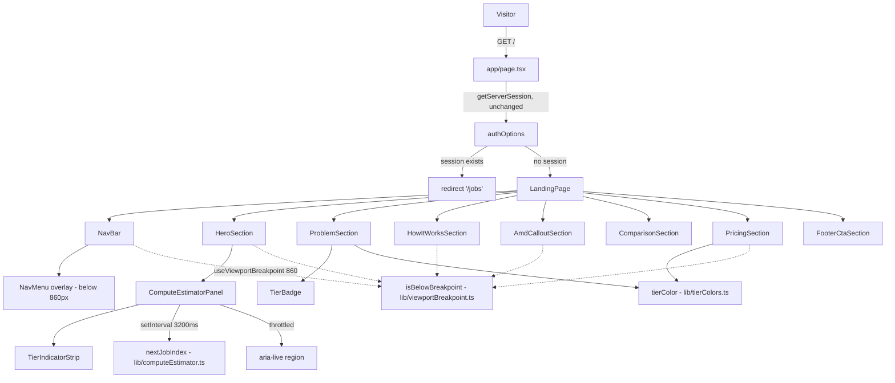

# Design Document: Landing Page Redesign

## Overview

The landing page at `/` currently exists (built under `landing-page-3d`): a session-gated Next.js page rendering seven sections, with a `three`/`@react-three/fiber`/`@react-three/drei` GPU chip model as the hero centerpiece. This feature keeps the route wiring and session-redirect behavior exactly as-is, and replaces the hero's 3D model — plus the visual system around it — with the design defined by `neuralgrid_landing.html`: a dark, telemetry/terminal-styled page whose signature element is a **Compute_Estimator_Panel**, a non-3D widget that cycles through hardcoded Sample_Jobs on a fixed interval.

**What changes:**
- `HeroSection` drops pointer/scroll capture and `GpuSceneOrFallback`; gains eyebrow label, two-line accent headline, stat line, Secondary_CTA, and `ComputeEstimatorPanel`.
- The entire `gpu-scene/` directory is deleted. `three`, `@react-three/fiber`, `@react-three/drei`, and `framer-motion` (only used by the deleted `useScroll` call) are removed from `dashboard/package.json`.
- A new `NavBar` (with mobile `NavMenu` overlay) is added — the current page has no nav bar at all.
- `ProblemSection`, `HowItWorksSection`, `AmdCalloutSection`, `ComparisonSection`, `PricingSection`, `FooterCtaSection` are restyled to the new dark/mono aesthetic but keep reading from the same content modules (`wasteFactors.ts`, `competitors.ts`, `pricingTiers.ts`, `amdCallout.ts`) — no content data changes.
- `tailwind.config.js` gains the T1/T2/T3 tier colors and the cyan accent color (Requirement 5.2, 5.3) — nothing else.

**What stays untouched:** `app/page.tsx`'s session check/redirect, all four content data modules' exported values, `vitest.config.ts`, the overall App Router structure.

**Key design decisions:**

- **860px is a JS-driven breakpoint, not a Tailwind screen.** Requirement 14.3 only permits extending `tailwind.config.js` with the tier/accent color tokens from Requirement 5 — adding a custom `screens.nav: '860px'` entry would be an unlisted config addition. Also, jsdom (this project's Vitest environment) does not evaluate CSS `@media` queries, so a pure-CSS breakpoint would be untestable beyond a string-snapshot of class names. Instead, a single pure function `isBelowBreakpoint(width, threshold)` backs a `useViewportBreakpoint(860)` hook (native `matchMedia`, no new dependency), reused by every section that needs 860px reflow logic. This gives one real, property-testable boundary function instead of eight copies of ad-hoc CSS.
- **Non-token colors are arbitrary Tailwind values, not new config tokens.** Panel/border/muted-text colors from the mockup (`#12171C`, `#212930`, `#8B96A1`, etc.) are applied via Tailwind's bracket syntax (`bg-[#12171C]`) rather than named config entries, so `tailwind.config.js`'s `theme.extend.colors` only grows by the tier + accent tokens Requirement 5 actually requires.
- **Fonts are loaded via `next/font/google`, not a Tailwind config change.** Requirement 5.4/5.5 need a distinct mono font and a distinct display font. `next/font` generates CSS custom properties applied on `<html>`/`<body>` in `layout.tsx`; components reference them with Tailwind's arbitrary-value font utilities (`font-[family-name:var(--font-mono)]`). This satisfies the fonts requirement without touching `theme.extend.fontFamily`, keeping the color-token restriction in 14.3 literal.
- **The Compute_Estimator_Panel's visual update rate and its ARIA announcement rate are decoupled.** The panel must visually cycle every 3.2s (Requirement 4.3) but must not let assistive tech announce more than once per 5s (Requirement 13.3). A single `currentJob` state re-renders the visible panel every 3.2s; a second, throttled `announcedJob` state feeds the `aria-live` region and only updates when a pure throttle function says enough time has passed. This is the one place in the feature where a "for any sequence of timestamps" property genuinely applies.
- **`usePrefersReducedMotion` is relocated, not rewritten.** The existing hook in `gpu-scene/` has no 3D dependency — it's a plain `matchMedia` hook. It moves to `components/landing/hooks/` before `gpu-scene/` is deleted, satisfying Requirement 4.7/4.5's reduced-motion check with zero new code.
- **Sample_Jobs are a fixed array, not a generator.** Requirement 4.1 specifies a fixed, hardcoded set (5–10 entries) — this is fixture data, not something to synthesize, so it lives in a new `content/sampleJobs.ts` module following the same pattern as the other content files, populated with the five jobs already defined in `neuralgrid_landing.html`'s reference script (their VRAM/cost values already satisfy the 0.1–100GB / $0.0001–$1.00 bounds).

## Architecture



**Data flow for the Compute_Estimator_Panel:** a `setInterval(3200)` inside `ComputeEstimatorPanel` calls the pure `nextJobIndex(currentIndex, jobs.length)` function and sets `currentIndex` state, which drives the visible job/gauges/`TierIndicatorStrip`. A separate `useEffect` watches `currentIndex` and calls the pure throttle function against `Date.now()`; only when it returns `true` does the `announcedIndex` state (feeding the `aria-live` text) update. Reduced-motion state comes from the relocated `usePrefersReducedMotion()` hook and only toggles a CSS class (pulsing dot vs. static dot) — it never pauses the interval itself, matching Requirement 4.7's "SHALL continue cycling."

## Components and Interfaces

### File layout

```
dashboard/src/
  app/
    page.tsx                          # UNCHANGED: session check + redirect | <LandingPage />
  components/
    landing/
      LandingPage.tsx                 # composes NavBar + all sections
      NavBar.tsx                      # logo, section links, Nav_CTA, Nav_Menu_Toggle (below 860px)
      NavMenu.tsx                     # mobile overlay: section links + Nav_CTA
      HeroSection.tsx                 # eyebrow, headline, subtext, stat line, CTAs, mounts ComputeEstimatorPanel
      ComputeEstimatorPanel.tsx       # telemetry panel: job cycling, gauges, TierIndicatorStrip, route-out row
      TierIndicatorStrip.tsx          # 3-LED strip, lights the LED matching the current tier
      TierBadge.tsx                   # tier-colored label used by ProblemSection (and reusable elsewhere)
      ProblemSection.tsx              # restyled waste-factor table, reads content/wasteFactors.ts
      HowItWorksSection.tsx           # restyled 4-step flow, dashed connector at/above 860px
      AmdCalloutSection.tsx           # restyled AMD spotlight strip
      ComparisonSection.tsx           # restyled competitor table, reads content/competitors.ts
      PricingSection.tsx              # restyled T1/T2/T3 cards, reads content/pricingTiers.ts
      FooterCtaSection.tsx            # restyled closing CTA + GitHub link
      lib/
        computeEstimator.ts          # nextJobIndex (pure), SAMPLE_JOBS re-export type helpers
        tierColors.ts                # TIER_COLORS map, tierColor(tier) (pure)
        tierBadge.ts                 # parseTierLabel(label) (pure)
        comparisonIndicator.ts       # routingIndicator(supported) (pure)
        viewportBreakpoint.ts        # isBelowBreakpoint (pure) + useViewportBreakpoint hook
        liveRegionThrottle.ts        # shouldAnnounce (pure) + foldAnnouncements (pure) + useThrottledAnnouncement hook
      hooks/
        usePrefersReducedMotion.ts   # RELOCATED from gpu-scene/, unchanged implementation
    content/
      wasteFactors.ts                 # UNCHANGED
      competitors.ts                  # UNCHANGED
      pricingTiers.ts                 # UNCHANGED
      amdCallout.ts                   # UNCHANGED
      heroContent.ts                  # UPDATED: eyebrow, headline parts, subtext, stat, both CTA labels
      sampleJobs.ts                   # NEW: fixed Sample_Job[] for the Compute_Estimator_Panel
  # DELETED entirely:
  #   components/landing/gpu-scene/{ChipModel,GpuScene,GpuSceneOrFallback,StaticFallback,
  #                                  useComplexityTier,useWebglSupported,transforms}.*
  #   (usePrefersReducedMotion.ts moves out first, see above)
```

### `app/page.tsx` — unchanged

No changes. It already does exactly what Requirement 1.2 requires (`getServerSession` → redirect `/jobs`, else render `<LandingPage />`).

### `content/sampleJobs.ts` (Requirement 4.1)

```typescript
export type Tier = 'T1' | 'T2' | 'T3';
export type ConfidenceLevel = 'HIGH' | 'MEDIUM' | 'LOW';

export interface SampleJob {
  name: string;
  vramGb: number;       // 0.1–100
  confidence: ConfidenceLevel;
  tier: Tier;
  provider: string;
  costUsd: number;      // 0.0001–1.00
}

export const SAMPLE_JOBS: SampleJob[] = [
  { name: 'llama-3-8b · inference',    vramGb: 8.5,  confidence: 'HIGH',   tier: 'T1', provider: 'Fireworks AI',  costUsd: 0.0023 },
  { name: 'sdxl · image gen',          vramGb: 8.0,  confidence: 'HIGH',   tier: 'T2', provider: 'Vast.ai',       costUsd: 0.0180 },
  { name: 'mistral-7b · fine-tune',    vramGb: 19.4, confidence: 'MEDIUM', tier: 'T2', provider: 'RunPod',        costUsd: 0.0410 },
  { name: 'llama-3-70b · inference',   vramGb: 62.0, confidence: 'HIGH',   tier: 'T3', provider: 'AMD Dev Cloud', costUsd: 0.1720 },
  { name: 'musicgen-large · audio',    vramGb: 8.0,  confidence: 'MEDIUM', tier: 'T1', provider: 'Fireworks AI',  costUsd: 0.0095 },
];
```

Five entries, satisfying "between 5 and 10" (Requirement 4.1); every field is within the stated bounds. Sourced from the mockup's own cycling data so the demo matches `neuralgrid_landing.html` exactly.

### `lib/computeEstimator.ts` (Requirement 4.3)

```typescript
/** Pure. For any non-empty length, wraps from the last index back to 0. */
export function nextJobIndex(currentIndex: number, length: number): number {
  if (length <= 0) throw new Error('nextJobIndex requires a non-empty list');
  return (currentIndex + 1) % length;
}

export const CYCLE_INTERVAL_MS = 3200;
```

`ComputeEstimatorPanel` holds `currentIndex` in state, seeded at `0` (Requirement 4.2), and a `useEffect` with `setInterval(() => setCurrentIndex(i => nextJobIndex(i, SAMPLE_JOBS.length)), CYCLE_INTERVAL_MS)`, cleared on unmount. No visitor interaction handler exists anywhere in the component (Requirement 4.6 — satisfied by absence, same technique the 3D spec used for its "no frame-rate kill switch" requirement).

### `lib/tierColors.ts` (Requirement 5.2)

```typescript
export type Tier = 'T1' | 'T2' | 'T3';

export const TIER_COLORS: Record<Tier, string> = {
  T1: '#3DDC97',
  T2: '#F5A623',
  T3: '#FF5470',
};

export const ACCENT_CYAN = '#7FD1FF';
export const BG_COLOR = '#0A0D10';

/** Pure, deterministic. Distinct across T1/T2/T3, and distinct from BG_COLOR/ACCENT_CYAN. */
export function tierColor(tier: Tier): string {
  return TIER_COLORS[tier];
}
```

Every consumer (`TierIndicatorStrip`, `TierBadge`, `PricingSection`'s tier-card accent) imports `tierColor` rather than hardcoding a hex value, so Requirement 5.2's "consistently across the Compute_Estimator_Panel, Problem_Section, and Pricing_Section" holds by construction — there is exactly one place a tier maps to a color.

### `lib/tierBadge.ts` (Requirement 6.2)

The existing `wasteFactors.ts` values are strings like `'RTX 3060 (8GB) — T1'` — the tier token is embedded, not a separate field. Rather than change the content module (Requirement 14.4 forbids duplicating/reshaping source data — reformatting is fine, but simplest is a parser than a data migration):

```typescript
export interface ParsedTierLabel {
  tier: 'T1' | 'T2' | 'T3' | null;
  remainder: string;
}

const TIER_PATTERN = /\bT[123]\b/;

/** Pure. Extracts the tier token from anywhere in the label; remainder is
 *  the label with that token and its adjacent separator characters removed. */
export function parseTierLabel(label: string): ParsedTierLabel {
  const match = label.match(TIER_PATTERN);
  if (!match) return { tier: null, remainder: label.trim() };
  const tier = match[0] as 'T1' | 'T2' | 'T3';
  const remainder = label
    .replace(TIER_PATTERN, '')
    .replace(/^[\s—\-–·]+|[\s—\-–·]+$/g, '')
    .trim();
  return { tier, remainder };
}
```

`ProblemSection` calls `parseTierLabel(row.tierNeeded)` / `parseTierLabel(row.tierTypicallyUsed)` and renders `<TierBadge tier={parsed.tier}>{parsed.remainder}</TierBadge>` — the tier-colored badge plus the adjacent hardware text, satisfying Requirement 6.2 without altering `wasteFactors.ts`.

### `TierBadge.tsx`

```typescript
interface TierBadgeProps {
  tier: 'T1' | 'T2' | 'T3';
  children: React.ReactNode; // remainder text, e.g. "RTX 3060 (8GB)"
}

export function TierBadge({ tier, children }: TierBadgeProps) {
  return (
    <span
      className="inline-flex items-center gap-1 rounded px-2 py-0.5 font-[family-name:var(--font-mono)] text-xs font-semibold"
      style={{ backgroundColor: `${tierColor(tier)}1f`, color: tierColor(tier) }}
    >
      {tier} · {children}
    </span>
  );
}
```

### `lib/comparisonIndicator.ts` (Requirement 9.2)

```typescript
/** Pure. Checkmark iff supported. */
export function routingIndicator(supported: boolean): '✓' | '✗' {
  return supported ? '✓' : '✗';
}
```

### `lib/viewportBreakpoint.ts` (Requirements 2.5, 7.3, 7.4, 12.2–12.5, 12.7)

```typescript
'use client';
import { useEffect, useState } from 'react';

/** Pure. True for any width strictly less than threshold. */
export function isBelowBreakpoint(width: number, threshold: number): boolean {
  return width < threshold;
}

/**
 * Live-updating, SSR-safe (defaults to false pre-mount, matching the
 * existing usePrefersReducedMotion convention). Backed by matchMedia so
 * resize/orientation changes are picked up without a page reload
 * (Requirement 12.7) via native DOM APIs only (Requirement 14.2).
 */
export function useViewportBreakpoint(thresholdPx: number): boolean {
  const [isBelow, setIsBelow] = useState(false);

  useEffect(() => {
    const query = window.matchMedia(`(max-width: ${thresholdPx - 1}px)`);
    setIsBelow(query.matches);
    const handleChange = (event: MediaQueryListEvent) => setIsBelow(event.matches);
    query.addEventListener('change', handleChange);
    return () => query.removeEventListener('change', handleChange);
  }, [thresholdPx]);

  return isBelow;
}
```

Every section needing 860px reflow calls `useViewportBreakpoint(860)` once and branches its JSX (hide links vs. show toggle, render vs. omit the connector line, grid-cols-4 vs. grid-cols-1, etc.) — one hook, one pure function underneath, reused everywhere instead of duplicated per-section logic.

### `lib/liveRegionThrottle.ts` (Requirement 13.3)

```typescript
/** Pure, single-step. True if never announced, or enough time has passed. */
export function shouldAnnounce(lastAnnouncedAt: number | null, now: number, minIntervalMs: number): boolean {
  return lastAnnouncedAt === null || now - lastAnnouncedAt >= minIntervalMs;
}

/**
 * Pure, sequence-level. Given an ascending sequence of update timestamps,
 * returns the subsequence that would actually be announced under the
 * minIntervalMs floor — useful directly in property tests.
 */
export function foldAnnouncements(timestamps: number[], minIntervalMs: number): number[] {
  const announced: number[] = [];
  let last: number | null = null;
  for (const t of timestamps) {
    if (shouldAnnounce(last, t, minIntervalMs)) {
      announced.push(t);
      last = t;
    }
  }
  return announced;
}
```

`ComputeEstimatorPanel` calls `shouldAnnounce` each time `currentIndex` changes (every 3.2s) against a `lastAnnouncedAtRef`; only on `true` does `announcedIndex` state update, which is what the `aria-live="polite"` element actually renders. The visible panel (job name, gauges, `TierIndicatorStrip`, route-out row) always reflects `currentIndex` at full 3.2s frequency — only the screen-reader text is throttled.

### `NavBar.tsx` / `NavMenu.tsx` (Requirement 2)

```typescript
export function NavBar() {
  const isMobile = useViewportBreakpoint(860);
  const [menuOpen, setMenuOpen] = useState(false);

  return (
    <nav className="flex items-center justify-between border-b border-[#1A2026] px-6 py-5">
      <Logo />
      {!isMobile && <NavLinks />}
      <div className="flex items-center gap-3">
        {!isMobile && <NavCta />}
        {isMobile && (
          <button aria-label={menuOpen ? 'Close menu' : 'Open menu'} onClick={() => setMenuOpen((open) => !open)}>
            <MenuIcon />
          </button>
        )}
      </div>
      {isMobile && menuOpen && (
        <NavMenu onLinkActivate={() => setMenuOpen(false)} />
      )}
    </nav>
  );
}
```

Activating a link scrolls via `element.scrollIntoView({ behavior: 'smooth', block: 'start' })` (native DOM API, Requirement 14.2) and, inside `NavMenu`, also calls `onLinkActivate` to close the overlay (Requirement 2.7). Toggle behavior (`setMenuOpen((open) => !open)`) is a plain boolean flip — Property 9 below covers its round-trip correctness in isolation from any DOM/breakpoint concerns.

### `ComputeEstimatorPanel.tsx` (Requirement 4, 13.3)

```typescript
export function ComputeEstimatorPanel() {
  const [currentIndex, setCurrentIndex] = useState(0);
  const [announcedIndex, setAnnouncedIndex] = useState(0);
  const lastAnnouncedAtRef = useRef<number | null>(null);
  const prefersReducedMotion = usePrefersReducedMotion();

  useEffect(() => {
    const id = setInterval(() => {
      setCurrentIndex((i) => nextJobIndex(i, SAMPLE_JOBS.length));
    }, CYCLE_INTERVAL_MS);
    return () => clearInterval(id);
  }, []);

  useEffect(() => {
    const now = Date.now();
    if (shouldAnnounce(lastAnnouncedAtRef.current, now, 5000)) {
      lastAnnouncedAtRef.current = now;
      setAnnouncedIndex(currentIndex);
    }
  }, [currentIndex]);

  const job = SAMPLE_JOBS[currentIndex];
  const announcedJob = SAMPLE_JOBS[announcedIndex];

  return (
    <div className="rounded-xl border border-[#212930] bg-[#12171C] p-5 font-[family-name:var(--font-mono)]">
      <div className="mb-4 flex items-center justify-between border-b border-[#1A2026] pb-3 text-[11px] uppercase tracking-wide text-[#5C6670]">
        <span>Compute Estimator</span>
        <span className="flex items-center gap-1.5 text-[#3DDC97]">
          <span className={`h-1.5 w-1.5 rounded-full bg-[#3DDC97] ${prefersReducedMotion ? '' : 'animate-pulse'}`} />
          live
        </span>
      </div>

      <div aria-live="polite" className="mb-3 text-sm text-[#8B96A1]">
        Job in: <span className="text-[#E7EDF2]">{announcedJob.name}</span>
      </div>

      {/* gauges (VRAM, confidence), TierIndicatorStrip, route-out row all read `job`, not `announcedJob` */}
      <TierIndicatorStrip activeTier={job.tier} />
      {/* ... */}
    </div>
  );
}
```

The `animate-pulse` class (a built-in Tailwind utility, not a new dependency) is applied only when `prefersReducedMotion` is `false`; when `true`, the dot is present but static and no transform/opacity animation class is ever added — satisfying Requirement 4.7's "SHALL NOT render any continuous transform or opacity animation" by conditional class omission rather than an animation that's merely paused.

### `TierIndicatorStrip.tsx` (Requirement 4.4)

```typescript
const TIERS: Tier[] = ['T1', 'T2', 'T3'];

export function TierIndicatorStrip({ activeTier }: { activeTier: Tier }) {
  return (
    <div className="mb-4 flex gap-2">
      {TIERS.map((tier) => {
        const lit = tier === activeTier; // pure equality — Property 2
        return (
          <div
            key={tier}
            className="flex-1 rounded-md border px-2 py-2.5 text-center transition-colors"
            style={lit ? { borderColor: tierColor(tier), backgroundColor: `${tierColor(tier)}1f` } : { borderColor: '#212930' }}
          >
            <div className="text-[11px] font-semibold" style={{ color: lit ? tierColor(tier) : '#5C6670' }}>{tier}</div>
          </div>
        );
      })}
    </div>
  );
}
```

## Data Models

Content data models (`WasteFactorRow`, `CompetitorRow`, `PricingTierRow`, AMD callout constants) are unchanged from the current implementation — see the existing `dashboard/src/components/content/*.ts` files. The only additions are:

```typescript
// content/sampleJobs.ts — see full listing above
export type Tier = 'T1' | 'T2' | 'T3';
export type ConfidenceLevel = 'HIGH' | 'MEDIUM' | 'LOW';
export interface SampleJob {
  name: string;
  vramGb: number;
  confidence: ConfidenceLevel;
  tier: Tier;
  provider: string;
  costUsd: number;
}
```

```typescript
// content/heroContent.ts — updated shape
export const HERO_EYEBROW = 'Automatic GPU tier routing';
export const HERO_HEADLINE_PLAIN = 'Stop paying ';
export const HERO_HEADLINE_ACCENT = 'A100 prices';
export const HERO_HEADLINE_TAIL = ' for RTX 3060 jobs.';
export const HERO_SUBTEXT =
  'NeuralGrid profiles every job you submit and routes it to the cheapest GPU tier that can actually run it — across providers, automatically.';
export const HERO_STAT = '40% average cost reduction vs manually picking GPUs on RunPod';
export const PRIMARY_CTA_LABEL = 'Get started';
export const SECONDARY_CTA_LABEL = 'See how routing works';
```

Splitting the headline into three exported string constants (rather than one string with embedded markup) keeps `HeroSection` a plain template with no HTML-in-content-data smell, while still letting Requirement 3.2's accent phrase be wrapped in its own `<span>`.

## Correctness Properties

*A property is a characteristic or behavior that should hold true across all valid executions of a system — essentially, a formal statement about what the system should do. Properties serve as the bridge between human-readable specifications and machine-verifiable correctness guarantees.*

Most acceptance criteria in this feature are static content/markup presence checks (fixed strings, fixed table rows) or real-layout visual measurements (overlap, rendered area, LCP) that are either example-based or out of scope for unit testing (see Testing Strategy). The properties below cover the parts of the design that are pure functions over a meaningfully large input space, per the prework analysis and its redundancy reflection.

### Property 1: Sample_Job cycling always advances and wraps correctly

*For any* non-negative current index less than a list length, and *for any* list length of at least 1, `nextJobIndex(currentIndex, length)` SHALL return `(currentIndex + 1) % length` — in particular, calling it with `currentIndex = length - 1` SHALL return `0`.

**Validates: Requirements 4.3**

### Property 2: Tier_Indicator_Strip lights exactly the matching LED

*For any* `Tier` value assigned as the active tier and *for any* `Tier` value checked as a LED's own tier, the LED SHALL be lit if and only if the two values are equal — so for any active tier, exactly one of the three LEDs is lit and the other two are unlit.

**Validates: Requirements 4.4**

### Property 3: Reduced-motion preference determines the live indicator's animation branch, never the cycling itself

*For any* boolean `prefersReducedMotion` value, the live status indicator SHALL render the pulsing animation class if and only if `prefersReducedMotion` is `false`, and SHALL never omit or alter the Sample_Job cycling behavior described in Property 1 for either value of `prefersReducedMotion`.

**Validates: Requirements 4.5, 4.7**

### Property 4: Tier color mapping is deterministic and pairwise distinct

*For any* two `Tier` values, `tierColor` SHALL return the same color for the same tier on every call (determinism), and SHALL return different colors for different tier values (pairwise distinctness); additionally, for all three tier values, `tierColor` SHALL return a value different from `BG_COLOR` and from `ACCENT_CYAN`.

**Validates: Requirements 5.2, 10.3**

### Property 5: Tier badge parsing round-trips through formatting

*For any* tier value and *for any* non-empty remainder text not itself containing a `T1`/`T2`/`T3` token, formatting the two into a label (in either "hardware — TIER" or "TIER · hardware" order, with any of the separators `—`, `-`, `–`, `·` used in the existing content data) and then parsing that label with `parseTierLabel` SHALL recover the original tier value and the original remainder text (modulo surrounding whitespace).

**Validates: Requirements 6.2**

### Property 6: Comparison indicator is a total, correct mapping from support to symbol

*For any* boolean `supported` value, `routingIndicator(supported)` SHALL return `'✓'` if and only if `supported` is `true`, and `'✗'` otherwise — it SHALL never return any other value.

**Validates: Requirements 9.2**

### Property 7: Viewport breakpoint check is a correct, total boundary function

*For any* non-negative viewport width and *for any* positive breakpoint threshold, `isBelowBreakpoint(width, threshold)` SHALL return `true` if and only if `width < threshold`; in particular, for `threshold = 860`, widths of `859` SHALL map to `true` and widths of `860` and `861` SHALL both map to `false`.

**Validates: Requirements 2.5, 7.3, 7.4, 12.2, 12.3, 12.4, 12.5, 12.7**

### Property 8: Live-region announcements are never closer together than the minimum interval

*For any* ascending sequence of update timestamps and *for any* positive `minIntervalMs`, `foldAnnouncements(timestamps, minIntervalMs)` SHALL return a subsequence of the input in which every pair of consecutive returned timestamps differs by at least `minIntervalMs`, and the first timestamp in the input, if present, SHALL always be included.

**Validates: Requirements 13.3**

### Property 9: Nav menu toggle is a self-inverse over open/closed state

*For any* current boolean menu-open state, toggling it once SHALL produce the opposite boolean value, and toggling it twice in succession SHALL return to the original value.

**Validates: Requirements 2.6**

## Error Handling

The Landing_Page has no data fetching beyond the existing `getServerSession` call (unchanged from `landing-page-3d`), so error handling here is scoped to the new client-side widget logic.

| Condition | Handling |
|---|---|
| `getServerSession` throws or returns an unexpected shape | Unchanged existing behavior: falls through to rendering `LandingPage` rather than a broken redirect. |
| `nextJobIndex` called with `length <= 0` | Throws explicitly rather than returning a misleading index — cannot occur in practice since `SAMPLE_JOBS` is a fixed non-empty array, but the guard documents the function's precondition and fails loudly if that invariant is ever broken (e.g. by a future edit emptying the array). |
| `parseTierLabel` given a label with no `T1`/`T2`/`T3` token | Returns `{ tier: null, remainder: label.trim() }` rather than throwing; `ProblemSection` falls back to plain (unstyled) text for `remainder` when `tier` is `null`, so a malformed future data entry degrades to plain text instead of crashing the table render. |
| `window.matchMedia` unavailable (very old browser / non-DOM test environment) | `useViewportBreakpoint` and `usePrefersReducedMotion` both only call `matchMedia` inside `useEffect` (post-mount, client-only), and both default their state to `false` pre-mount — matching the existing `usePrefersReducedMotion` convention from `landing-page-3d`, so SSR and any environment lacking `matchMedia` synchronously never throw. |
| Dynamic import / lazy-loading | Not applicable — this feature intentionally removes the only dynamic-import boundary that existed (`GpuSceneOrFallback`'s `next/dynamic`), since there is no heavy client-only library left to isolate. |
| Nav link target section missing from the DOM (defensive) | `scrollIntoView` calls are guarded by a `null` check on the resolved element (`document.getElementById(id)?.scrollIntoView(...)`), so a broken anchor id fails silently instead of throwing. |

## Testing Strategy

**Unit / component tests** (Vitest + `@testing-library/react` + `jsdom` — added as new devDependencies, matching the `dashboard-redesign` spec's precedent since neither is currently installed despite `landing-page-3d`'s design assuming them):
- `app/page.tsx`: unchanged behavior re-verified (session → redirect; no session → `LandingPage`).
- Content presence per section: `HeroSection` renders `HERO_EYEBROW`, both headline segments (with the accent segment in a separately-styled element), `HERO_SUBTEXT`, `HERO_STAT`, both CTA labels; `ProblemSection` renders all `WASTE_FACTORS` rows with `TierBadge`s; `ComparisonSection` renders `NEURALGRID_ROW` first then `COMPETITORS` in order; `PricingSection` renders exactly 3 cards in T1/T2/T3 order with each `exampleWorkload`; `AmdCalloutSection` contains both `AMD_PROVIDERS` names, `AMD_MI300X_VRAM`, and `AMD_MI300X_RELEVANCE`; `HowItWorksSection` renders all 4 step titles/descriptions with numbered circles 1–4 in order; `FooterCtaSection` always renders its CTA and GitHub link together.
- `ComputeEstimatorPanel`: on mount shows `SAMPLE_JOBS[0]`; after advancing fake timers by `3200ms` shows `SAMPLE_JOBS[1]`; the `aria-live` element carries `aria-live="polite"`.
- `NavBar`: `useViewportBreakpoint` mocked to `false` → links + CTA visible, no toggle; mocked to `true` → links hidden, toggle visible; clicking the toggle opens `NavMenu`; clicking a link inside `NavMenu` closes it (mock `scrollIntoView`).
- `HowItWorksSection`: connector element present when `useViewportBreakpoint` mocked `false`, absent when mocked `true`; step text present in both cases (Requirement 7.5).
- Accessibility: `Primary_CTA`/`Secondary_CTA`/`Nav_CTA`/footer CTA are native `<a>`/`<button>` elements with no `tabIndex={-1}`; each has an accessible name between 1 and 100 characters.
- `dashboard/package.json`: allow-list test asserting `three`, `@react-three/fiber`, `@react-three/drei`, `framer-motion` are absent from `dependencies` (Requirement 14.1); a static-source-scan test asserting no file under `src/` imports from a `gpu-scene` path or from `three`/`@react-three/*` (Requirement 14.5), and that `tailwind.config.js`'s `theme.extend.colors` keys are a subset of the pre-existing keys plus exactly the tier/accent additions (Requirement 14.3).

**Property-based tests** (fast-check, already a devDependency; minimum 100 runs per property, tagged per the format below):
- Implemented purely against the `lib/*.ts` modules — no component mounting required.
- Tag format: `Feature: landing-page-redesign, Property {number}: {property text}`.
- Generators: `fc.tuple(fc.nat(), fc.integer({ min: 1, max: 20 }))` filtered to `currentIndex < length` for Property 1, plus an explicit pinned case at `currentIndex = length - 1`; `fc.constantFrom('T1','T2','T3')` (paired, two independent draws) for Properties 2 and 4; `fc.boolean()` for Properties 3 and 6; `fc.constantFrom('T1','T2','T3')` combined with `fc.string().filter(s => !/T[123]/.test(s))` and a `fc.constantFrom` over the separator set for Property 5; `fc.integer({ min: 0, max: 4000 })` for width and a fixed/varied threshold in Property 7, with explicit boundary cases (859, 860, 861) additionally pinned; `fc.array(fc.integer({ min: 0, max: 1_000_000 }), { minLength: 1 }).map(arr => [...arr].sort((a, b) => a - b))` for ascending timestamp sequences in Property 8; `fc.boolean()` for Property 9's toggle round trip.

**Visual / manual QA** (not automated, tracked as a manual pass before demo recording):
- Requirements 3.8, 3.9, 12.1, 12.6: rendered at `320px`, `sm`, `md`, `lg`, `xl`, `2xl`, and at 859/860/861px in a real browser, checking for overlap, no horizontal scrollbar, and the Compute_Estimator_Panel reading as the largest hero element at `lg`+.
- Requirement 2.4/2.7: manual check that section-link scroll lands within 16px of the target section's top edge within 1 second (native `scrollIntoView` timing is browser-controlled and not meaningfully fake-timer-testable).
- Requirement 5.1/5.4/5.5: visual check that the dark background, monospace data font, and display heading font are applied consistently across all seven sections.

**Integration checks:**
- A single manual smoke pass confirming `/` unauthenticated shows the redesigned landing page (no canvas/WebGL element present anywhere in the DOM) and `/` authenticated still redirects to `/jobs` — same convention `landing-page-3d` used, since no e2e suite exists in `dashboard/` yet.

## Styling and Theme

`tailwind.config.js` gains exactly the tier and accent color tokens (Requirement 5.2, 5.3), nothing else (Requirement 14.3):

```javascript
/** @type {import('tailwindcss').Config} */
module.exports = {
  content: ['./src/**/*.{js,ts,jsx,tsx}'],
  theme: {
    extend: {
      colors: {
        'ng-bg': '#0a0a0f',              // unchanged, still used by non-landing dashboard pages
        'ng-surface': '#111116',          // unchanged, still used by non-landing dashboard pages
        'ng-accent-violet': '#7c3aed',    // unchanged, still used elsewhere in the dashboard app
        'ng-accent-cyan': '#7FD1FF',      // UPDATED hex to match the new mockup's cyan (Requirement 5.3)
        'ng-tier-1': '#3DDC97',           // NEW — Requirement 5.2
        'ng-tier-2': '#F5A623',           // NEW — Requirement 5.2
        'ng-tier-3': '#FF5470',           // NEW — Requirement 5.2
      },
      backgroundImage: {
        'ng-hero-gradient': 'radial-gradient(circle at 50% 20%, rgba(124,58,237,0.25), transparent 60%), radial-gradient(circle at 80% 80%, rgba(34,211,238,0.15), transparent 55%)',
        'ng-section-gradient': 'linear-gradient(180deg, #0a0a0f 0%, #111116 100%)',
      },
    },
  },
  plugins: [],
};
```

`ng-accent-violet`/`ng-bg`/`ng-surface`/the two `backgroundImage` gradients are left in place rather than removed — they predate this feature and Requirement 14.3 restricts *additions*, not cleanup of pre-existing tokens the landing page no longer uses. Panel/border/muted-text values that appear in the mockup (`#12171C`, `#161C22`, `#212930`, `#1A2026`, `#E7EDF2`, `#8B96A1`, `#5C6670`) are applied as Tailwind arbitrary values (`bg-[#12171C]`, `text-[#8B96A1]`, etc.) directly in each component rather than named config entries, per the design decision above.

`layout.tsx` adds `next/font/google` loaders for the display and mono fonts, exposing them as CSS variables consumed via Tailwind's arbitrary `font-[family-name:var(--font-x)]` utilities:

```typescript
import { Space_Grotesk, JetBrains_Mono } from 'next/font/google';

const displayFont = Space_Grotesk({ subsets: ['latin'], variable: '--font-display' });
const monoFont = JetBrains_Mono({ subsets: ['latin'], variable: '--font-mono' });

export default function RootLayout({ children }: { children: ReactNode }) {
  return (
    <html lang="en" className={`${displayFont.variable} ${monoFont.variable}`}>
      <body>
        <Providers>{children}</Providers>
      </body>
    </html>
  );
}
```

Body text keeps the existing default sans stack (no third font family needs a dedicated loader; Requirement 5.5 only requires headings' display font be distinct from body and mono, which this satisfies).

## Accessibility

- Every CTA (`Primary_CTA`, `Secondary_CTA`, `Nav_CTA`, footer CTA, `Nav_Menu_Toggle`) is a native `<a>`/`<button>` in normal document order with no `tabIndex` override, and each carries a visible `:focus-visible` outline via a shared Tailwind utility class — reachable in default tab order without custom focus management (Requirement 13.2).
- The Compute_Estimator_Panel's dynamic text sits inside a single `aria-live="polite"` element whose content is driven by the throttled `announcedIndex` state (Property 8), not the full-frequency `currentIndex` — satisfying "no more than once every 5 seconds regardless of update frequency" (Requirement 13.3) structurally rather than relying on browser/AT-specific `aria-live` coalescing behavior.
- Section headings use one `<h1>` (hero headline) followed by one `<h2>` per subsequent section, giving screen readers a predictable outline (carried over from `landing-page-3d`'s convention).
- `NavMenu`'s overlay traps no focus and adds no `aria-hidden` trickery beyond closing itself on link activation — kept intentionally simple since Requirement 13.4 notes no decorative/animated elements remain in this redesign.

## Dependencies

Removed from `dashboard/package.json` (Requirement 14.1):

```json
{
  "dependencies": {
    "three": "REMOVE",
    "@react-three/fiber": "REMOVE",
    "@react-three/drei": "REMOVE",
    "framer-motion": "REMOVE"
  },
  "devDependencies": {
    "@types/three": "REMOVE"
  }
}
```

`framer-motion` is removed alongside the 3D libraries because its only call site (`useScroll` in the old `HeroSection`) is deleted with the pointer/scroll interaction it supported; nothing else in `dashboard/src` imports it (confirmed by search).

Added, dev-only, for the test suite (not currently installed despite being assumed by `landing-page-3d`'s own design):

```json
{
  "devDependencies": {
    "@testing-library/react": "^16.0.1",
    "@testing-library/jest-dom": "^6.5.0",
    "jsdom": "^25.0.1"
  }
}
```

`fast-check` (`^3.15.0`) is already present and reused as-is for the property tests above. `vitest.config.ts`'s `environment` changes from `'node'` to `'jsdom'` so `@testing-library/react` can render components — the property tests against `lib/*.ts` are plain functions and are unaffected by that environment change.
