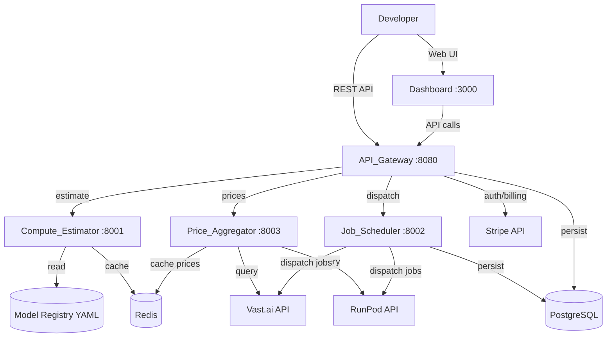

# Design Document: NeuralGrid MVP

## Overview

NeuralGrid MVP is a microservices-based GPU task routing system. Developers submit AI jobs via REST API. System classifies compute needs, finds cheapest GPU node across providers, dispatches job, returns result.

**Core flow:**
```
POST /v1/jobs → Compute_Estimator (tier assignment) → Price_Aggregator (cheapest node) → Job_Scheduler (dispatch + monitor) → Result
```

**Key design decisions:**
- Microservices over monolith: each service has distinct scaling needs (Price_Aggregator polls frequently, Job_Scheduler needs worker pool)
- Redis for caching over in-memory: shared state across service instances
- YAML model registry over database: simpler to update, version-controlled, read-heavy workload
- Stripe for billing over custom: faster MVP, proven reliability
- PostgreSQL for job persistence: ACID for financial data, good querying for dashboard

## Architecture



**Service boundaries:**
- **API_Gateway**: HTTP routing, auth, validation, orchestration, billing
- **Compute_Estimator**: VRAM prediction, tier assignment, confidence scoring
- **Price_Aggregator**: Provider price polling, caching, availability tracking
- **Job_Scheduler**: Job dispatch, monitoring, retry logic, worker pool

**Communication:** Synchronous HTTP between services (simpler for MVP, acceptable latency). Redis pub/sub for job status updates to dashboard.

**Deployment:** Docker Compose for development. Each service independently deployable.

## Components and Interfaces

### API_Gateway (Port 8080)

**Responsibilities:** Request validation, authentication, rate limiting, orchestration, error responses, billing recording.

**Internal API (to other services):**
```
POST /internal/estimate    → Compute_Estimator
GET  /internal/prices/:tier → Price_Aggregator  
POST /internal/dispatch    → Job_Scheduler
GET  /internal/job/:id     → Job_Scheduler
```

**External API (to developers):**
```
POST   /v1/jobs                    → Submit job
GET    /v1/jobs/:id                → Poll status
GET    /v1/jobs/:id/result         → Get result
GET    /v1/models                  → List models
GET    /v1/models/:id/estimate     → Cost estimate
```

### Compute_Estimator (Port 8001)

**Interface:**
```typescript
interface EstimateRequest {
  model: string;
  quantization?: string;  // fp32 | fp16 | int8 | int4
  input_tokens?: number;
  max_tokens?: number;
}

interface EstimateResponse {
  tier: "T1" | "T2" | "T3";
  min_vram_gb: number;
  estimated_runtime_seconds: number;
  estimated_cost_usd: string;
  confidence: "HIGH" | "MEDIUM" | "LOW";
}
```

**Logic:**
1. Lookup model in registry → if exact VRAM found → HIGH confidence
2. If LLM without exact match → formula: `vram = (params_B × bytes_per_param × 1.2) + (tokens × 0.000002 × 1024)` → MEDIUM confidence, +20% buffer
3. If LOW confidence → promote tier one level up
4. Tier thresholds: T1 (0-12GB), T2 (12-28GB), T3 (28GB+)

### Price_Aggregator (Port 8003)

**Interface:**
```typescript
interface PriceRequest {
  tier: "T1" | "T2" | "T3";
}

interface PriceResponse {
  nodes: ProviderNode[];
  cached: boolean;
  cache_age_seconds: number;
}

interface ProviderNode {
  provider: "vastai" | "runpod";
  node_id: string;
  gpu_model: string;
  vram_gb: number;
  hourly_rate_usd: number;
  availability: boolean;
}
```

**Behavior:**
- Polls providers every 60s
- Caches in Redis with 90s TTL
- Returns cached data on provider failure
- Excludes provider if cache expired AND provider unreachable

### Job_Scheduler (Port 8002)

**Interface:**
```typescript
interface DispatchRequest {
  job_id: string;
  model: string;
  tier: "T1" | "T2" | "T3";
  input: JobInput;
  output: JobOutput;
  quantization: string;
  selected_node: ProviderNode;
}

interface JobStatusResponse {
  job_id: string;
  status: "queued" | "running" | "complete" | "failed";
  provider?: string;
  actual_cost_usd?: string;
  result?: JobResult;
  retries: number;
}
```

**Behavior:**
- Worker pool (configurable size, default 10)
- Dispatches to provider API
- Monitors job until complete/failed
- On failure: retry up to 2 more times on different provider
- Records actual cost based on runtime × hourly rate

### Dashboard (Port 3000)

**Tech:** Next.js + NextAuth (JWT) + Stripe Elements

**Pages:**
- `/jobs` — job list with filters
- `/keys` — API key management (create/revoke)
- `/billing` — spend tracking, savings comparison
- `/login` — NextAuth sign-in

## Data Models

### PostgreSQL Schema

```sql
-- Developers table
CREATE TABLE developers (
  id UUID PRIMARY KEY DEFAULT gen_random_uuid(),
  email VARCHAR(255) UNIQUE NOT NULL,
  name VARCHAR(255),
  stripe_customer_id VARCHAR(255),
  max_cost_usd DECIMAL(10,4) DEFAULT 10.00,
  payment_status VARCHAR(20) DEFAULT 'active', -- active | failed
  created_at TIMESTAMPTZ DEFAULT NOW(),
  updated_at TIMESTAMPTZ DEFAULT NOW()
);

-- API keys table
CREATE TABLE api_keys (
  id UUID PRIMARY KEY DEFAULT gen_random_uuid(),
  developer_id UUID REFERENCES developers(id) ON DELETE CASCADE,
  key_hash VARCHAR(64) NOT NULL,  -- SHA-256 of full key
  key_prefix VARCHAR(10) NOT NULL, -- "ng_" + first 7 chars for display
  name VARCHAR(100),
  is_active BOOLEAN DEFAULT true,
  last_used_at TIMESTAMPTZ,
  created_at TIMESTAMPTZ DEFAULT NOW(),
  revoked_at TIMESTAMPTZ
);

-- Jobs table
CREATE TABLE jobs (
  id VARCHAR(30) PRIMARY KEY,  -- "job_" + ULID
  developer_id UUID REFERENCES developers(id),
  model VARCHAR(100) NOT NULL,
  tier VARCHAR(5) NOT NULL,      -- T1, T2, T3
  quantization VARCHAR(10),
  status VARCHAR(20) NOT NULL DEFAULT 'queued',  -- queued, running, complete, failed
  input_payload JSONB NOT NULL,
  output_config JSONB NOT NULL,
  result_payload JSONB,
  provider VARCHAR(20),          -- vastai, runpod
  node_id VARCHAR(100),
  estimated_cost_usd DECIMAL(10,6),
  actual_cost_usd DECIMAL(10,6),
  confidence VARCHAR(10),        -- HIGH, MEDIUM, LOW
  retries INTEGER DEFAULT 0,
  error_message TEXT,
  created_at TIMESTAMPTZ DEFAULT NOW(),
  started_at TIMESTAMPTZ,
  completed_at TIMESTAMPTZ
);

-- Billing records
CREATE TABLE billing_records (
  id UUID PRIMARY KEY DEFAULT gen_random_uuid(),
  developer_id UUID REFERENCES developers(id),
  job_id VARCHAR(30) REFERENCES jobs(id),
  amount_usd DECIMAL(10,6) NOT NULL,
  stripe_charge_id VARCHAR(255),
  status VARCHAR(20) DEFAULT 'pending', -- pending, charged, failed
  created_at TIMESTAMPTZ DEFAULT NOW()
);

CREATE INDEX idx_jobs_developer_status ON jobs(developer_id, status);
CREATE INDEX idx_jobs_created_at ON jobs(created_at DESC);
CREATE INDEX idx_api_keys_hash ON api_keys(key_hash);
CREATE INDEX idx_billing_developer ON billing_records(developer_id, created_at DESC);
```

### Redis Keys

```
prices:{tier}:{provider}  → JSON ProviderNode[]  (TTL 90s)
provider:failures:{provider} → Integer counter   (TTL 300s)
rate_limit:{api_key_prefix} → Integer counter    (TTL 60s)
job:status:{job_id}        → JSON JobStatus      (TTL 3600s)
```

### Model Registry (YAML)

```yaml
models:
  llama-3-8b:
    family: llama
    params_billions: 8
    default_quantization: int8
    vram_gb: { fp32: 38, fp16: 19, int8: 10, int4: 5 }
    tier: T1
    input_types: [text]
    output_types: [text]
```

## Correctness Properties

*A property is a characteristic or behavior that should hold true across all valid executions of a system — essentially, a formal statement about what the system should do. Properties serve as the bridge between human-readable specifications and machine-verifiable correctness guarantees.*

### Property 1: VRAM Calculation Correctness

*For any* LLM model with known params_billions, *for any* quantization in {fp32, fp16, int8, int4}, and *for any* token_count ≥ 0, the Compute_Estimator SHALL compute VRAM as `(params_billions × bytes_per_param × 1.2) + (token_count × 0.000002 × 1024)` where bytes_per_param is 4/2/1/0.5 for fp32/fp16/int8/int4 respectively. When an exact registry lookup exists, confidence SHALL be HIGH and VRAM SHALL match the registry value.

**Validates: Requirements 6.1, 6.2, 6.5**

### Property 2: Tier Assignment from VRAM

*For any* VRAM value in GB, the Compute_Estimator SHALL assign: T1 if 0 ≤ VRAM ≤ 12, T2 if 12 < VRAM ≤ 28, T3 if VRAM > 28.

**Validates: Requirements 6.4**

### Property 3: LOW Confidence Tier Promotion

*For any* job where the Compute_Estimator assigns Confidence_Level LOW, the returned tier SHALL be one level higher than the calculated tier (T1→T2, T2→T3, T3 remains T3).

**Validates: Requirements 6.3**

### Property 4: Cheapest Node Selection

*For any* non-empty set of available provider nodes at a required tier, the Job_Scheduler SHALL select the node with the minimum hourly_rate_usd.

**Validates: Requirements 8.1**

### Property 5: Retry Invariant — Different Provider, Max 2 Retries

*For any* job that fails on a provider node, the Job_Scheduler SHALL retry on a different provider (never the same one that failed) and SHALL NOT retry more than 2 additional times before marking the job as "failed".

**Validates: Requirements 8.4, 8.5**

### Property 6: Invalid Model Rejection

*For any* model identifier not present in the Model_Registry, the API_Gateway SHALL return a 400 error with code MODEL_NOT_SUPPORTED for both job submission and cost estimation endpoints.

**Validates: Requirements 1.2, 4.3**

### Property 7: Authentication Enforcement

*For any* API request where the Authorization header is missing, malformed, or does not contain a valid key with the "ng_" prefix, the API_Gateway SHALL return a 401 error with code UNAUTHORIZED.

**Validates: Requirements 1.3, 9.1, 9.2**

### Property 8: Budget Exceeded Detection

*For any* job submission where the computed estimated_cost_usd exceeds the developer's configured max_cost_usd, the API_Gateway SHALL return a 400 error with code BUDGET_EXCEEDED.

**Validates: Requirements 1.4**

### Property 9: Job Status Value Invariant

*For any* job returned by the API_Gateway, the status field SHALL be exactly one of: "queued", "running", "complete", or "failed".

**Validates: Requirements 2.3**

### Property 10: Job Isolation

*For any* developer, a GET request to /v1/jobs/:id with an ID belonging to a different developer SHALL return 404 JOB_NOT_FOUND. No job data from other developers SHALL be accessible.

**Validates: Requirements 2.2**

### Property 11: Result Availability Gate

*For any* job with status other than "complete", a GET request to /v1/jobs/:id/result SHALL return 409 JOB_NOT_COMPLETE.

**Validates: Requirements 3.2**

### Property 12: Result Shape by Output Type

*For any* completed job, if output type is "text" the result SHALL contain content, tokens_generated, model, and finish_reason. If output type is "image" the result SHALL contain image URLs with expires_at, width, and height.

**Validates: Requirements 3.1, 3.3, 3.4**

### Property 13: Cost Estimate Response Completeness

*For any* valid estimate request, the response SHALL contain tier, min_vram_gb, estimated_runtime_seconds, estimated_cost_usd, confidence, and a vs_runpod_a100 comparison where saving_pct = (runpod_cost - estimated_cost) / runpod_cost × 100.

**Validates: Requirements 4.1, 4.2**

### Property 14: Model Registry Listing Completeness

*For any* GET request to /v1/models, the response SHALL contain every model from the Model_Registry with id, family, default_tier, supported_quantizations, input_types, and output_types. The total field SHALL equal the number of models returned.

**Validates: Requirements 5.1, 5.2**

### Property 15: Input Validation — Unsupported Quantization and Input Type

*For any* (model, quantization) pair where the quantization is not in the model's supported list, the API_Gateway SHALL return 400 with supported quantizations listed. *For any* (model, input_type) pair where the input_type is not in the model's supported list, the API_Gateway SHALL return 400 with supported input types listed.

**Validates: Requirements 12.1, 12.3**

### Property 16: Missing Field Validation

*For any* job submission request missing one or more of {model, input, output}, the API_Gateway SHALL return 400 with a message identifying exactly which fields are missing.

**Validates: Requirements 12.2**

### Property 17: Actual Cost Calculation

*For any* completed job, actual_cost_usd SHALL equal provider_hourly_rate × (runtime_seconds / 3600).

**Validates: Requirements 10.1**

### Property 18: Provider Circuit Breaker

*For any* provider that experiences 3 or more consecutive job failures, the Job_Scheduler SHALL deprioritize that provider in routing decisions for 5 minutes.

**Validates: Requirements 13.3**

### Property 19: Billing Period Spend Calculation

*For any* developer, the displayed total spend SHALL equal the sum of actual_cost_usd for all completed jobs in the current billing period. The savings percentage SHALL equal (sum_runpod_equivalent - sum_actual_cost) / sum_runpod_equivalent × 100.

**Validates: Requirements 11.2, 11.5**

## Error Handling

### Error Response Format

All errors follow consistent structure:

```json
{
  "error": {
    "code": "ERROR_CODE",
    "message": "Human-readable description",
    "details": {}  // optional, e.g. supported_quantizations list
  }
}
```

### Error Codes and HTTP Status Mapping

| Code | HTTP | Trigger |
|------|------|---------|
| UNAUTHORIZED | 401 | Missing/invalid API key |
| PAYMENT_FAILED | 402 | Stripe charge failed |
| RATE_LIMIT_EXCEEDED | 429 | Too many requests in window |
| MODEL_NOT_SUPPORTED | 400 | Model not in registry |
| BUDGET_EXCEEDED | 400 | Estimated cost > max_cost_usd |
| INVALID_REQUEST | 400 | Missing fields, bad quantization, bad input type |
| JOB_NOT_FOUND | 404 | Job doesn't exist or belongs to another developer |
| JOB_NOT_COMPLETE | 409 | Result requested for non-complete job |
| INSUFFICIENT_CAPACITY | 503 | No nodes available at required tier |
| INTERNAL_ERROR | 500 | Unexpected system failure |

### Retry and Failover Strategy

1. **Provider dispatch failure:** Retry up to 2× on different provider
2. **Price_Aggregator provider query failure:** Serve cached data, exclude provider only when cache expires
3. **Stripe payment failure:** Block subsequent job submissions with 402 until resolved
4. **Inter-service communication failure:** API_Gateway returns 500 with INTERNAL_ERROR, logs full context

### Circuit Breaker (Provider Level)

- Track consecutive failures per provider in Redis (`provider:failures:{name}`)
- After 3 consecutive failures → deprioritize for 5 minutes
- Reset counter on successful dispatch
- TTL 300s on failure counter key ensures auto-recovery

## Testing Strategy

### Unit Tests

Focus on specific examples, edge cases, and integration points:

- **Compute_Estimator:** Known model lookups, boundary VRAM values (11.9GB, 12.1GB, 27.9GB, 28.1GB), edge cases (0 tokens, max tokens)
- **API_Gateway validation:** Specific malformed requests, exact error message content
- **Job_Scheduler:** Specific retry sequences, worker pool behavior
- **Price_Aggregator:** Cache hit/miss scenarios, provider failure handling

### Property-Based Tests

Each correctness property above maps to a property-based test with minimum 100 iterations.

**Library:** [fast-check](https://github.com/dubzzz/fast-check) (TypeScript/Node.js)

**Configuration:**
- Minimum 100 iterations per property
- Each test tagged: `Feature: neuralgrid-mvp, Property {N}: {title}`
- Generators produce:
  - Random valid model names from registry
  - Random invalid model names (strings not in registry)
  - Random quantization values (valid and invalid per model)
  - Random VRAM values across full range (0-300 GB)
  - Random token counts (0 to 100,000)
  - Random provider node lists with varying prices
  - Random job states and transitions
  - Random API key formats (valid ng_ prefix and invalid)

**Key property tests:**
- Properties 1-3: Compute_Estimator pure logic (VRAM formula, tier assignment, promotion)
- Properties 4-5: Job_Scheduler selection and retry logic
- Properties 6-8: API_Gateway validation (model, auth, budget)
- Properties 9-12: Response shape invariants
- Properties 15-16: Input validation
- Property 17: Cost calculation
- Property 18: Circuit breaker logic

### Integration Tests

- Provider API mocking (Vast.ai, RunPod response formats)
- Redis caching behavior (TTL, expiry, failover)
- Stripe webhook handling
- End-to-end job lifecycle: submit → poll → result
- NextAuth sign-in flow
- Dashboard API key management

### Load/Performance Tests

- Rate limiting behavior under concurrent requests
- Worker pool saturation and queue behavior
- Price cache performance under high read volume

