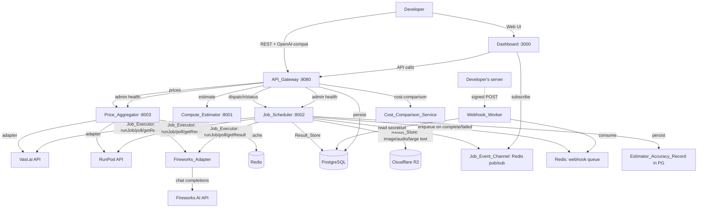
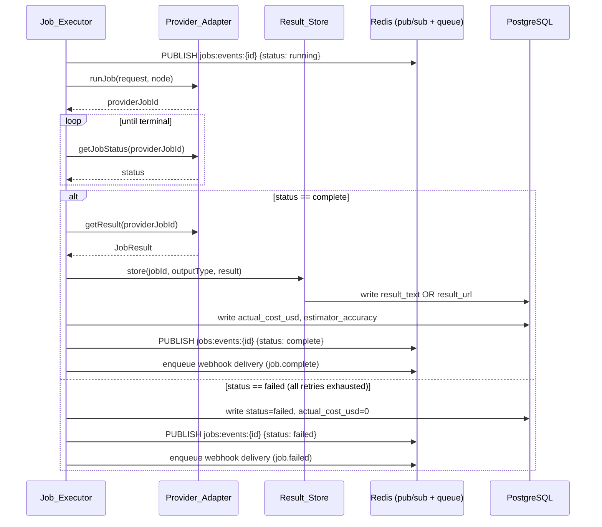
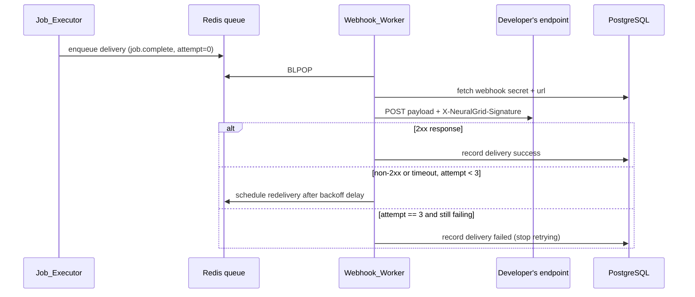

# Design Document: NeuralGrid Stage 2

## Overview

Stage 2 turns the Stage 1 routing demo into a working product. Stage 1 picks the cheapest node and stops; Stage 2 actually runs the job, stores the result, charges the real cost, and tells the developer about it — synchronously (poll) or asynchronously (webhook, OpenAI-compatible stream). It also makes the savings story visible in the Dashboard and gives operators a health view.

Work is organized into six groups matching the requirements document and the Stage 2 PRD's spec numbers:

| Group | Spec | New/changed components |
|---|---|---|
| A | SPEC-01 | `Fireworks_Adapter` in Price_Aggregator, shared type extensions |
| B | SPEC-02 | `Job_Executor` in Job_Scheduler, `Result_Store`, cost calc, Redis events |
| C | SPEC-03 | `OpenAI_Compat` route in API_Gateway |
| D | SPEC-04 | `webhooks` table + routes, `Webhook_Worker` |
| E | SPEC-05 | `Cost_Comparison_Service`, Savings_Dashboard |
| F | SPEC-06 | Admin_Health_Endpoint, Admin_Dashboard, Estimator_Accuracy_Record |

**Key design decisions:**

- **Provider_Adapter interface first (Group A/B):** Vast.ai, RunPod, and Fireworks all implement the same four-method shape (`listNodes`, `runJob`, `getJobStatus`, `getResult`). This lets the Job_Executor dispatch to any provider without a switch statement, and lets Fireworks slot into Price_Aggregator's existing polling cycle unchanged.
- **Fireworks priced by normalization, not by a separate code path.** Converting `$/M tokens` to an hourly-rate equivalent at `listNodes()` time means `selectCheapestNode` (Stage 1, unchanged) already compares Fireworks fairly against hourly providers. No scheduler changes needed for price comparison.
- **Result routing by type+size threshold, not by provider.** Whether a result goes inline or to object storage depends only on `output.type` and payload size, decided once in `Result_Store`, independent of which provider produced it.
- **Object storage: Cloudflare R2.** Chosen over Supabase Storage per the PRD's suggested options because the stack already uses S3-compatible tooling conventions (`@aws-sdk/client-s3` works against R2's S3-compatible endpoint with zero egress fees), and it avoids adding Supabase as a new infra dependency for a single bucket use case.
- **Webhook_Worker as a new lightweight process, not a module bolted onto API_Gateway.** Delivery involves outbound HTTP calls with retry/backoff sleeps of up to 25s. Running that inside the request-serving API_Gateway process would tie up its event loop and mix concerns with rate-limited request handling. A separate consumer process (same pattern as Job_Scheduler's worker pool) keeps API_Gateway responsive and lets the worker scale independently.
- **Cost_Comparison_Service computes the RunPod A100 baseline at dispatch time, not lookup time.** The RunPod A100 hourly rate can move over time (Price_Aggregator re-polls it). Freezing the baseline rate on the job row at dispatch means a job's stored comparison never changes retroactively when RunPod's price shifts — the developer's "what I actually saved" answer for a past job stays stable. `GET /v1/jobs/:id/cost-comparison` reads this frozen baseline for the requested job, and separately computes *current* per-provider estimates for the what-if calculator using live prices.
- **1.20 margin lives in one place:** `Job_Executor`'s cost calculation. This supersedes the Stage 1 formula (`actual_cost_usd = hourly_rate × runtime_hours`, no margin) for every job that goes through the Stage 2 execution path, per the note in the requirements Introduction. Stage 1's `dispatcher.ts:calculateCost` is retained only as the base rate calculation Job_Executor wraps with `× 1.20`; nothing outside Job_Executor multiplies by margin twice.

## Architecture



**New/changed communication paths vs Stage 1:**
- Job_Scheduler now calls out to provider APIs for real (Stage 1's `dispatchToProvider` was a placeholder fetch to a nonexistent dispatch endpoint; Group B replaces it with real per-provider adapters).
- Redis gains two new uses: a pub/sub channel per job (`neuralgrid:jobs:events:{job_id}`) and a durable queue for webhook deliveries.
- A new external dependency: Cloudflare R2 (S3-compatible) for binary/large results.
- A new process: Webhook_Worker, deployed and scaled independently of API_Gateway and Job_Scheduler.

## Components and Interfaces

### Group A — Fireworks AI Integration

#### Shared type extensions (`packages/shared/src/types.ts`)

```typescript
export type Provider = "vastai" | "runpod" | "fireworks" | "amd-cloud";
export type HardwareVendor = "AMD" | "NVIDIA" | "unknown";

export interface ProviderNode {
  provider: Provider;
  node_id: string;
  gpu_model: string;
  vram_gb: number;
  hourly_rate_usd: number;
  availability: boolean;
  hardware_vendor: HardwareVendor;   // new
  is_warm?: boolean;                 // new — true for serverless providers
}
```

`hardware_vendor` is added as a required field (not optional) so every existing adapter (`vastai.ts`, `runpod.ts`) must be updated to set it explicitly — Vast.ai/RunPod nodes default to `"unknown"` since GPU vendor isn't reliably reported by either API today. This is a small, additive change to `mapOfferToNode` / `mapGpuToNode`.

`amd-cloud` is added to the `Provider` union per Requirement 1.5 but has no adapter in Stage 2 — it exists only so downstream code (health endpoint, dashboards) can reference it as a configured-but-not-yet-implemented provider without a type error.

#### `Fireworks_Model_Map` (`services/price-aggregator/src/providers/fireworksModels.ts`)

```typescript
export interface FireworksModelEntry {
  modelId: string;           // e.g. "accounts/fireworks/models/llama-v3-8b-instruct"
  tier: Tier;
  minVramGb: number;
  pricePerMToken: number;    // USD per 1M tokens
}

export const FIREWORKS_MODELS: Record<string, FireworksModelEntry> = {
  "llama-3-8b":   { modelId: "accounts/fireworks/models/llama-v3-8b-instruct",     tier: "T1", minVramGb: 8,   pricePerMToken: 0.20 },
  "llama-3-70b":  { modelId: "accounts/fireworks/models/llama-v3-70b-instruct",    tier: "T3", minVramGb: 40,  pricePerMToken: 0.90 },
  "mixtral-8x7b": { modelId: "accounts/fireworks/models/mixtral-8x7b-instruct",    tier: "T2", minVramGb: 24,  pricePerMToken: 0.50 },
  "llama-3-405b": { modelId: "accounts/fireworks/models/llama-v3p1-405b-instruct", tier: "T3", minVramGb: 192, pricePerMToken: 3.00 },
  "qwen2-72b":    { modelId: "accounts/fireworks/models/qwen2-72b-instruct",       tier: "T3", minVramGb: 40,  pricePerMToken: 0.90 },
  "phi-3-mini":   { modelId: "accounts/fireworks/models/phi-3-mini-128k-instruct", tier: "T1", minVramGb: 4,   pricePerMToken: 0.10 },
};

export const FIREWORKS_TOKENS_PER_HOUR = 500_000;
```

Keyed by NeuralGrid model id (matching `model_registry.yaml` conventions) so the Job_Executor and OpenAI_Compat route can look up a model without a separate translation step.

#### `FireworksAdapter` (`services/price-aggregator/src/providers/fireworks.ts`)

Implements the same `Provider_Adapter` shape as `vastai.ts`/`runpod.ts` plus the two execution methods Stage 1 adapters didn't need:

```typescript
export interface ProviderAdapter {
  listNodes(minVramGb: number): Promise<ProviderNode[]>;
  runJob(job: DispatchRequest, node: ProviderNode): Promise<{ providerJobId: string }>;
  getJobStatus(providerJobId: string): Promise<JobStatus>;
  getResult(providerJobId: string): Promise<JobResult>;
}

export class FireworksApiError extends Error {
  constructor(message: string, public statusCode?: number, public responseBody?: string) { super(message); this.name = "FireworksApiError"; }
}

export class FireworksAdapter implements ProviderAdapter {
  async listNodes(minVramGb: number): Promise<ProviderNode[]> {
    return Object.entries(FIREWORKS_MODELS)
      .filter(([, entry]) => entry.minVramGb >= minVramGb)
      .map(([modelKey, entry]) => ({
        provider: "fireworks",
        node_id: modelKey,
        gpu_model: "MI300X",
        vram_gb: entry.minVramGb,
        hourly_rate_usd: normalizeHourlyRate(entry.pricePerMToken),
        availability: true,
        is_warm: true,
        hardware_vendor: safeSetHardwareVendor("AMD"), // 1.4: never blocks node availability
      }));
  }

  // Because Fireworks is serverless request/response, runJob calls the chat
  // completions API synchronously and returns a synthetic providerJobId that
  // already carries the terminal result — getJobStatus/getResult read from an
  // in-memory/Redis result cache keyed by that id rather than polling Fireworks again.
  async runJob(job: DispatchRequest, node: ProviderNode): Promise<{ providerJobId: string }> { /* ... */ }
  async getJobStatus(providerJobId: string): Promise<JobStatus> { /* ... */ }
  async getResult(providerJobId: string): Promise<JobResult> { /* ... */ }
}

export function normalizeHourlyRate(pricePerMToken: number): number {
  return (pricePerMToken / 1_000_000) * FIREWORKS_TOKENS_PER_HOUR;
}
```

`safeSetHardwareVendor` wraps the AMD tag assignment in a try/catch that logs and falls through to returning the vendor value regardless (Requirement 1.4) — it never throws out of `listNodes`.

`runJob` posts to `https://api.fireworks.ai/inference/v1/chat/completions` with the mapped `modelId` and the job's message content. On a 2xx response it stores `{ status: "complete", content, tokens_generated }` against the synthetic `providerJobId`; on error it stores `{ status: "failed", error }` — this is what makes Requirement 4.3/4.4 hold unconditionally: the adapter never has a code path that writes `complete` off of an error response, because the write happens once, from the single point where the HTTP result is inspected.

#### Startup validation (`services/price-aggregator/src/index.ts`)

Add to the existing startup sequence, before `pollAll()`'s first run:

```typescript
if (!process.env.FIREWORKS_API_KEY) {
  console.error("[startup] FIREWORKS_API_KEY is not set — Price_Aggregator cannot start");
  process.exit(1);
}
```

This check runs unconditionally on every start (Requirement 2.4) and its log message is distinct from other startup failures (Requirement 2.5) by naming the specific env var, matching how the existing `.env.example` / docker-compose pattern documents `VASTAI_API_KEY` / `RUNPOD_API_KEY`.

#### Integration into the existing polling cycle

`pollAll()` in `index.ts` already iterates `(tier, provider)` pairs and calls a `queryFn`. Fireworks is added as a third provider in that same loop calling `FireworksAdapter.listNodes(minVramForTier(tier))`, reusing the existing `cacheNodes` / Redis TTL machinery unchanged — Fireworks nodes are cached and served exactly like Vast.ai/RunPod nodes downstream.

### Group B — End-to-End Job Execution

#### `Provider_Adapter` common interface

Defined once in `@neuralgrid/shared` (so Job_Scheduler and Price_Aggregator import the same type) and implemented by `VastaiAdapter`, `RunpodAdapter` (new — Stage 1 only had query functions, not full adapters), and `FireworksAdapter`:

```typescript
export interface ProviderAdapter {
  listNodes(minVramGb: number): Promise<ProviderNode[]>;
  runJob(job: DispatchRequest, node: ProviderNode): Promise<{ providerJobId: string }>;
  getJobStatus(providerJobId: string): Promise<JobStatus>;
  getResult(providerJobId: string): Promise<JobResult>;
}
```

Vast.ai/RunPod's `runJob` spins up (or reuses) an instance, submits the job payload, and returns the provider's own job/instance id; `getJobStatus` polls that provider's status endpoint; `getResult` fetches output once terminal. This turns Stage 1's single placeholder `dispatchToProvider` fetch into three real per-provider implementations behind one interface, so `Job_Executor` never branches on provider name.

#### `Job_Executor` (`services/job-scheduler/src/executor.ts`, new)

Replaces the body of Stage 1's `dispatchJob` retry loop with a version that actually executes instead of simulating success/failure via an injected function. The retry *shape* (max 2 retries, never same provider twice, cheapest-remaining-node selection) is unchanged from Stage 1's `dispatcher.ts` — `Job_Executor` calls the same `selectCheapestNode` — but each "attempt" is now a full dispatch→poll→result cycle against a real `Provider_Adapter`, not a single mocked call.

```typescript
export async function executeJob(
  request: DispatchRequest,
  allNodes: ProviderNode[],
  getAdapter: (provider: Provider) => ProviderAdapter,
  deps: { redis: RedisPublisher; resultStore: ResultStore; webhookQueue: WebhookQueue; accuracyStore: AccuracyStore }
): Promise<JobStatusResponse> {
  const failedProviders = new Set<Provider>();
  let retries = 0;
  let currentNode: ProviderNode | null = request.selected_node;

  for (let attempt = 0; attempt <= MAX_JOB_RETRIES; attempt++) {
    if (!currentNode) break;
    await publishStatus(deps.redis, request.job_id, "running");

    const adapter = getAdapter(currentNode.provider);
    try {
      const { providerJobId } = await adapter.runJob(request, currentNode);

      let status: JobStatus;
      do {
        await sleep(POLL_INTERVAL_MS);
        status = await adapter.getJobStatus(providerJobId);
      } while (status === "running");

      if (status === "complete") {
        const result = await adapter.getResult(providerJobId);
        const stored = await deps.resultStore.store(request.job_id, request.output.type, result);
        const cost = calculateActualCost(currentNode, result, stored);
        await publishStatus(deps.redis, request.job_id, "complete");
        await recordAccuracy(deps.accuracyStore, request, stored);
        await enqueueWebhook(deps.webhookQueue, request.job_id, "job.complete", { ...cost, provider: currentNode.provider });
        return { job_id: request.job_id, status: "complete", provider: currentNode.provider, actual_cost_usd: cost.actual_cost_usd, result: stored, retries };
      }
      failedProviders.add(currentNode.provider);
    } catch {
      failedProviders.add(currentNode.provider);
    }

    if (attempt === MAX_JOB_RETRIES) break;
    const candidates = allNodes.filter((n) => !failedProviders.has(n.provider) && n.availability);
    currentNode = selectCheapestNode(candidates);
    if (currentNode) retries++;
  }

  await publishStatus(deps.redis, request.job_id, "failed");
  await enqueueWebhook(deps.webhookQueue, request.job_id, "job.failed", { actual_cost_usd: "0.000000" });
  return { job_id: request.job_id, status: "failed", retries, actual_cost_usd: "0.000000" };
}
```

Requirement 9.4 ("enqueue failure marks completion process as failed") is handled inside `enqueueWebhook`: it always attempts the enqueue, and if the Redis `LPUSH`/`XADD` call throws, `executeJob` catches that specific failure and treats the whole completion as failed *for the purpose of this Requirement* — i.e. it's surfaced via a returned `completion_error` flag distinct from the job's own `status`, so a webhook-enqueue failure doesn't silently flip a genuinely completed job's status back to `failed` (that would contradict Requirement 7.2's "publish/notify failures never roll back the status change", which Requirement 9.4 is explicitly scoped alongside).

**Sequence — dispatch/execute/complete:**



#### `Result_Store` (`services/job-scheduler/src/resultStore.ts`, new)

```typescript
export interface StoredResult extends JobResult {
  result_text?: string;   // set when stored inline
  result_url?: string;    // set when stored in object storage
}

export interface ResultStore {
  store(jobId: string, outputType: "text" | "image" | "audio", result: JobResult): Promise<StoredResult>;
}

const INLINE_TEXT_MAX_BYTES = 100 * 1024; // 100KB

export function createResultStore(s3: S3Client, bucket: string): ResultStore {
  return {
    async store(jobId, outputType, result) {
      if (outputType === "text") {
        const bytes = Buffer.byteLength(result.content ?? "", "utf8");
        if (bytes < INLINE_TEXT_MAX_BYTES) {
          return { ...result, result_text: result.content };
        }
      }
      // image, audio, or oversized text
      const key = `${jobId}/${outputType}`;
      const body = outputType === "text" ? Buffer.from(result.content ?? "", "utf8") : result.binaryContent!;
      const url = await uploadToR2(s3, bucket, key, body);
      return { ...result, result_url: url };
    },
  };
}
```

Object storage: **Cloudflare R2**, addressed via the S3-compatible API (`@aws-sdk/client-s3` pointed at the account's R2 endpoint). Bucket name and R2 credentials (`R2_ACCOUNT_ID`, `R2_ACCESS_KEY_ID`, `R2_SECRET_ACCESS_KEY`, `R2_BUCKET`) are added to docker-compose/`.env.example` alongside the existing `VASTAI_API_KEY`/`RUNPOD_API_KEY`/`FIREWORKS_API_KEY` pattern. Uploaded URLs are the bucket's public/dev URL (or a signed URL if the bucket is private — matching Stage 1's image result shape, which already carries `expires_at`).

#### Cost calculation

```typescript
export const MARGIN_MULTIPLIER = 1.20;

export function calculateActualCost(node: ProviderNode, result: JobResult, stored: StoredResult): { actual_cost_usd: string } {
  if (node.provider === "fireworks") {
    const entry = FIREWORKS_MODELS[node.node_id];
    const cost = (result.tokens_generated! / 1_000_000) * entry.pricePerMToken * MARGIN_MULTIPLIER;
    return { actual_cost_usd: cost.toFixed(6) };
  }
  const cost = calculateCost(node.hourly_rate_usd, result.runtime_seconds ?? 0) * MARGIN_MULTIPLIER;
  return { actual_cost_usd: cost.toFixed(6) };
}
```

Reuses Stage 1's `calculateCost(hourly_rate, runtime_seconds)` for the hourly branch rather than re-deriving it, then applies the margin once on top — this is the "one place" referenced in the Overview's design decisions.

#### `Job_Event_Channel`

Channel name: `neuralgrid:jobs:events:{job_id}`, one channel per job (not a single shared channel), matching the Glossary definition exactly. Payload: `{"status": "...", "updatedAt": "<ISO8601>"}`. `publishStatus` wraps the Redis `PUBLISH` call in a try/catch — a publish failure is logged and swallowed, never thrown back into `executeJob`'s control flow (Requirement 7.2). The Dashboard subscribes to a job's channel while its detail page is open (via a small WebSocket/SSE bridge in API_Gateway, out of scope for a new component — reuses the existing Redis client already present in API_Gateway for rate limiting).

#### Retry/failover integration

No changes to `selector.ts` or `failover.ts` — `Job_Executor` calls `selectCheapestNode` exactly as Stage 1's `dispatchJob` did. The only change is what happens *between* node selection and the retry decision: a real `runJob`/poll/`getResult` cycle instead of a single mocked dispatch call. `MAX_JOB_RETRIES` (2) is imported unchanged from `@neuralgrid/shared`.

### Group C — OpenAI-Compatible Endpoint

#### `Model_Alias_Map` (`services/api-gateway/src/routes/chatCompletions.ts`, new)

```typescript
export const MODEL_ALIAS_MAP: Record<string, string> = {
  "gpt-3.5-turbo": "llama-3-8b",
  "gpt-4": "llama-3-70b",
  "gpt-4-turbo": "llama-3-405b",
  "gpt-4o": "qwen2-72b",
  "gpt-4o-mini": "phi-3-mini",
};
```

#### Request validation (Zod)

```typescript
const ChatMessageSchema = z.object({ role: z.enum(["system", "user", "assistant"]), content: z.string() });
const ChatCompletionRequestSchema = z.object({
  model: z.string(),
  messages: z.array(ChatMessageSchema).min(1),
  max_tokens: z.number().int().positive().optional(),
  temperature: z.number().min(0).max(2).optional(),
  stream: z.boolean().optional(),
});
```

`zod` is a new dependency for `api-gateway` (not currently in `package.json`) — added because the existing `middleware/validation.ts` hand-rolls checks against the model registry for the native `/v1/jobs` schema, but the OpenAI request schema is externally defined and benefits from a declarative schema the way the rest of Stage 2 (webhook payloads) also will.

#### Route handler flow

```typescript
router.post("/v1/chat/completions", async (req, res) => {
  const parsed = ChatCompletionRequestSchema.safeParse(req.body);
  if (!parsed.success) return res.status(400).json(createErrorResponse(ErrorCode.INVALID_REQUEST, "..."));

  const resolvedModel = resolveModel(parsed.data.model); // alias map -> direct id -> null
  if (!resolvedModel) return res.status(400).json(createErrorResponse(ErrorCode.MODEL_NOT_SUPPORTED, "..."));

  const jobRequest = buildJobSubmission(resolvedModel, parsed.data); // maps messages -> input, max_tokens/temperature -> execution params

  if (parsed.data.stream) {
    return streamChatCompletion(res, jobRequest); // SSE
  }
  const job = await submitAndAwaitCompletion(jobRequest); // reuses existing /v1/jobs submission + poll path internally
  return res.status(200).json(buildOpenAIResponse(job, resolvedModel));
});
```

`resolveModel` implements Requirement 10.2–10.4 as one function: alias map lookup first, then direct model-registry lookup, else `null` — mirroring the Stage 1 `MODEL_NOT_SUPPORTED` validation pattern already used in `middleware/validation.ts` and `estimate.ts`.

#### Response construction

```typescript
interface OpenAIResponse {
  id: string; object: "chat.completion"; created: number; model: string;
  choices: [{ index: 0; message: { role: "assistant"; content: string }; finish_reason: "stop" | "length" }];
  usage: { prompt_tokens: number; completion_tokens: number; total_tokens: number };
  neuralgrid?: { actual_cost_usd: string; tier_used: string; provider: string; savings_vs_openai_pct: number };
}
```

`savings_vs_openai_pct` is computed against a small static OpenAI list-price table (per-model, mirroring the shape of `RUNPOD_A100_RATE_PER_HOUR` in `estimate.ts` but keyed by OpenAI model name and priced per token rather than per hour), so the extension field doesn't depend on a live OpenAI pricing API call. The `neuralgrid` key is additive-only — `buildOpenAIResponse` builds the base OpenAI-shaped object first and spreads the extension on afterward, so stripping that one key always yields a schema-valid OpenAI response (Requirement 11.3).

#### Streaming (SSE)

```typescript
async function streamChatCompletion(res: Response, jobRequest: JobSubmission) {
  res.writeHead(200, { "Content-Type": "text/event-stream", "Cache-Control": "no-cache", Connection: "keep-alive" });
  for await (const chunk of dispatchStreamingJob(jobRequest)) {
    res.write(`data: ${JSON.stringify(toOpenAIChunk(chunk))}\n\n`);
  }
  res.write("data: [DONE]\n\n");
  res.end();
}
```

`dispatchStreamingJob` forwards Fireworks' own SSE stream chunk-for-chunk (Fireworks' chat completions API supports `stream: true` natively) for Fireworks-routed jobs; non-streaming providers (Vast.ai/RunPod) fall back to a single chunk emitted once `getResult` returns, still terminated by `data: [DONE]`.

#### Authentication

Reuses the existing `createAuthMiddleware` from `middleware/auth.ts` unchanged for the `ng_`-prefixed case (Requirement 13.1 — "authenticate as it does for other /v1 routes"). A small pre-check is added in front of it specifically on this route (and only this route, since it's the one place developers are likely to paste an OpenAI key):

```typescript
router.use("/v1/chat/completions", (req, res, next) => {
  const authHeader = req.headers.authorization ?? "";
  if (authHeader.startsWith("Bearer sk-") || authHeader.startsWith("sk-")) {
    return res.status(401).json(createErrorResponse(ErrorCode.UNAUTHORIZED, "This looks like an OpenAI key. Get a NeuralGrid API key (ng_...) at https://neuralgrid.dev/keys"));
  }
  next();
}, authMiddleware);
```

Missing header falls through to the existing `authMiddleware`, which already returns 401 UNAUTHORIZED for that case (Requirement 13.3, unchanged behavior).

### Group D — Webhook Delivery System

#### `webhooks` table (new migration, `scripts/migrations/002_webhooks.sql`)

```sql
CREATE TABLE webhooks (
  id UUID PRIMARY KEY DEFAULT gen_random_uuid(),
  developer_id UUID REFERENCES developers(id) ON DELETE CASCADE,
  url VARCHAR NOT NULL,
  secret VARCHAR NOT NULL,
  events TEXT[] DEFAULT ARRAY['job.complete', 'job.failed'],
  is_active BOOLEAN DEFAULT true,
  created_at TIMESTAMPTZ DEFAULT NOW()
);

CREATE INDEX idx_webhooks_developer ON webhooks(developer_id, is_active);
```

(`user_id` in the PRD's sketch is renamed `developer_id` to match this codebase's `developers` table, consistent with `api_keys`/`jobs`/`billing_records`.)

#### CRUD routes (`services/api-gateway/src/routes/webhooks.ts`, new)

```
POST   /v1/webhooks       — create; generates secret (crypto.randomBytes(32).toString('hex')), defaults events + is_active
GET    /v1/webhooks       — list developer's webhooks; secret field stripped from every entry
DELETE /v1/webhooks/:id   — sets is_active = false if owned by caller; 404 JOB_NOT_FOUND-style isolation otherwise
```

Ownership isolation follows the same pattern already used for `/v1/jobs/:id` in `jobs.ts` — look up by id, compare `developer_id` against the authenticated caller, 404 (not 403) on mismatch so existence isn't leaked.

#### Webhook enqueue (from `Job_Executor`, Group B)

On reaching `complete` or `failed`, `Job_Executor` looks up active webhooks for the job's developer whose `events` array contains the corresponding event name, and pushes one delivery job per matching webhook onto a Redis list/stream (`neuralgrid:webhooks:queue`):

```typescript
interface WebhookDeliveryJob {
  webhookId: string; url: string; secretRef: string; // secret fetched by worker, not embedded in queue payload
  payload: WebhookPayload;
  attempt: number; // 0 initially
}
```

#### `Webhook_Worker` (`services/webhook-worker/`, new service)

A new lightweight process, structurally parallel to `job-scheduler` (its own `package.json`, `src/index.ts` worker loop, Dockerfile, docker-compose entry) rather than a module inside `api-gateway`. Justification is in the Overview's design decisions: keeps API_Gateway's request path free of multi-second retry sleeps, and gives delivery its own scaling/restart lifecycle.

```typescript
export async function consumeQueue(redis: Redis, deps: { db: PgClient }): Promise<void> {
  const job = await redis.blpop("neuralgrid:webhooks:queue", 0);
  const delivery: WebhookDeliveryJob = JSON.parse(job[1]);
  await attemptDelivery(delivery, deps);
}

export async function attemptDelivery(delivery: WebhookDeliveryJob, deps: { db: PgClient }): Promise<void> {
  const webhook = await deps.db.getWebhook(delivery.webhookId);
  const body = JSON.stringify(delivery.payload);
  const signature = `sha256=${crypto.createHmac("sha256", webhook.secret).update(body).digest("hex")}`;

  const ok = await postWithTimeout(webhook.url, body, { "X-NeuralGrid-Signature": signature, "Content-Type": "application/json" });

  if (ok) return deps.db.recordDeliverySuccess(delivery.webhookId, delivery.payload.job_id);
  if (delivery.attempt >= RETRY_DELAYS_MS.length) return deps.db.recordDeliveryFailure(delivery.webhookId, delivery.payload.job_id);

  const delayMs = RETRY_DELAYS_MS[delivery.attempt]; // [1000, 5000, 25000]
  await scheduleRedelivery(redis, { ...delivery, attempt: delivery.attempt + 1 }, delayMs);
}
```

`RETRY_DELAYS_MS = [1000, 5000, 25000]` gives exactly 3 retries (Requirement 16.1/16.3) after the initial attempt. Redelivery scheduling uses a Redis sorted set keyed by "ready at" timestamp (`ZADD neuralgrid:webhooks:delayed <readyAtMs> <deliveryJson>`), with a small scanner loop moving due entries back onto the main queue — the same delayed-job pattern commonly used for Redis-backed retry queues, avoiding a dependency on `setTimeout` surviving a process restart mid-backoff.

**Sequence — webhook delivery:**



### Group E — Cost Savings Analytics

#### `Cost_Comparison_Service` (`services/api-gateway/src/costComparison.ts`, new)

Two distinct computations, matching the "dispatch time vs lookup time" split from the Overview:

1. **Frozen baseline at dispatch time:** `jobs` table gains a `runpod_a100_baseline_usd` column, written once by `Job_Executor` at dispatch (before execution starts, using the RunPod A100 rate cached in Price_Aggregator at that moment — reusing the existing `RUNPOD_A100_RATE_PER_HOUR` constant currently in `estimate.ts`, moved to `@neuralgrid/shared/constants` so both API_Gateway and Job_Scheduler can reference it, or fetched from Price_Aggregator's live RunPod cache for a more accurate node-specific rate). This value never changes after the job completes.
2. **Live lookup for `/v1/jobs/:id/cost-comparison`:** given the job's `tokens_generated`/`runtime_seconds` and stored `tier`, computes what that same usage would have cost on *every currently configured provider* (not just RunPod), using each provider's current cached rate from Price_Aggregator:

```typescript
export async function getCostComparison(job: Job, priceLookup: PriceLookup): Promise<CostComparisonResponse> {
  const estimates: Record<Provider, string> = {};
  for (const provider of CONFIGURED_PROVIDERS) {
    const rate = await priceLookup.getRateForTier(provider, job.tier);
    estimates[provider] = estimateCostForProvider(provider, rate, job).toFixed(6);
  }
  return { job_id: job.id, actual_cost_usd: job.actual_cost_usd, runpod_a100_baseline_usd: job.runpod_a100_baseline_usd, estimates };
}
```

Ownership check (`developer_id` mismatch → 404 `JOB_NOT_FOUND`) reuses the exact same lookup-then-compare pattern as `GET /v1/jobs/:id`.

#### `/dashboard/savings` page (`dashboard/src/app/savings/page.tsx`, new)

Server component following the `billing/page.tsx` pattern (session check via `getServerSession`, redirect to `/login` if absent). Structure:

- Hero cards: total saved this month, total saved all-time, average savings % per job (same card style as `billing/page.tsx`'s summary cards).
- Breakdown table by model, breakdown table by tier (same table style as the existing "Job Cost Breakdown" table).
- Monthly projection banner (single sentence, computed value).

Data comes from a new `GET /v1/analytics/savings` aggregation endpoint in API_Gateway (grouping completed jobs by month/model/tier and computing sums client-side-ready, so the page itself stays a thin renderer — matching how `billing/page.tsx` currently does its arithmetic over a flat job list).

#### Monthly projection

```typescript
export function projectMonthlySavings(trailingJobs: CompletedJob[], trailingDays: number): { neuralgridProjected: number; runpodProjected: number } {
  const dailyActual = sum(trailingJobs.map(j => j.actual_cost_usd)) / trailingDays;
  const dailyBaseline = sum(trailingJobs.map(j => j.runpod_a100_baseline_usd)) / trailingDays;
  return { neuralgridProjected: dailyActual * 30, runpodProjected: dailyBaseline * 30 };
}
```

#### "What if" calculator (dashboard home)

Client-side form (model + expected monthly job count) that calls a new `GET /v1/analytics/what-if?model=...&count=...` endpoint, which multiplies that model's typical per-job cost (from `Fireworks_Model_Map`/current price cache for the model's tier) and the RunPod A100 equivalent by `count`, returning both totals for the form to render.

### Group F — Provider Health Dashboard

#### `Admin_Health_Endpoint` (`services/api-gateway/src/routes/internalHealth.ts`, new)

```
GET /internal/health
Header: X-Admin-Key: <admin key>
```

```typescript
router.get("/internal/health", (req, res) => {
  if (req.headers["x-admin-key"] !== process.env.ADMIN_KEY) {
    return res.status(401).json(createErrorResponse(ErrorCode.UNAUTHORIZED, "Invalid admin key"));
  }
  // aggregate provider status from Price_Aggregator, job counts from PostgreSQL, accuracy from Estimator_Accuracy_Record
  res.status(200).json(buildHealthReport());
});
```

Kept as a header-based admin key (`X-Admin-Key`) rather than the `ng_`/Bearer scheme used elsewhere, since this is an operator-only internal route, not a developer-facing `/v1` endpoint — mirrors the PRD's "admin key required" language and keeps it clearly separate from the API-key auth middleware chain (it is deliberately *not* mounted under the `/v1` prefix that `authMiddleware`/`rateLimitMiddleware` apply to).

Response shape matches the PRD's sketch exactly: per-provider `{ status, lastPoll, nodesAvailable, circuitBreaker }` (status derivation reuses Price_Aggregator's existing circuit-breaker state in Redis — `provider:failures:{provider}` — rather than introducing a new health-state store; a provider with an open circuit breaker is `degraded` regardless of `nodesAvailable`, and `nodesAvailable === 0` alone never downgrades status per Requirement 20.2), `jobs.last1h`/`jobs.last24h` (computed with a `COUNT ... WHERE created_at > NOW() - INTERVAL` query against `jobs`), and `estimatorAccuracy` (aggregated from the new `estimator_accuracy_records` table below).

#### `Estimator_Accuracy_Record` (new table, same migration as webhooks or its own)

```sql
CREATE TABLE estimator_accuracy_records (
  id UUID PRIMARY KEY DEFAULT gen_random_uuid(),
  job_id VARCHAR(30) REFERENCES jobs(id),
  predicted_tier VARCHAR(5) NOT NULL,
  actual_tier VARCHAR(5) NOT NULL,
  classification VARCHAR(20) NOT NULL, -- correct | over_estimated | under_estimated
  created_at TIMESTAMPTZ DEFAULT NOW()
);

CREATE INDEX idx_accuracy_created_at ON estimator_accuracy_records(created_at DESC);
```

Written by `Job_Executor` at the same point it writes `actual_cost_usd` (end of the `status === "complete"` branch in the sequence above): it derives `actual_tier` from the job's real resource usage (VRAM tier implied by the node/model actually used) and compares against `job.tier` (the Compute_Estimator's prediction stored at submission). Requirement 21.1's "classification SHALL NOT be considered complete unless persisted" is implemented by making the `INSERT` synchronous and awaited before `executeJob` returns its `complete` result — a failed insert throws, which (like the webhook enqueue failure) is surfaced via the same `completion_error` signal rather than silently dropped.

```typescript
export function classifyAccuracy(predicted: Tier, actual: Tier): "correct" | "over_estimated" | "under_estimated" {
  const order = { T1: 1, T2: 2, T3: 3 };
  if (order[predicted] === order[actual]) return "correct";
  return order[predicted] > order[actual] ? "over_estimated" : "under_estimated";
}
```

#### `/dashboard/admin` page (`dashboard/src/app/admin/page.tsx`, new)

Server component checking `session.user.isAdmin` (a new boolean flag on the `developers` table / NextAuth session, `is_admin BOOLEAN DEFAULT false`) before rendering — same `getServerSession` + early-return pattern as `billing/page.tsx`, but redirecting to `/` (not `/login`) with an access-denied state when `isAdmin` is false rather than absent, since this is an authorization check, not an authentication check. Renders the same JSON shape returned by `/internal/health`, fetched server-side using a server-only admin key (never exposed to the browser).

## Data Models

### PostgreSQL schema additions

```sql
-- Extend jobs table (Group B, E)
ALTER TABLE jobs ADD COLUMN result_text TEXT;
ALTER TABLE jobs ADD COLUMN result_url VARCHAR;
ALTER TABLE jobs ADD COLUMN runpod_a100_baseline_usd DECIMAL(10,6);
ALTER TABLE jobs ADD COLUMN tokens_generated INTEGER;

-- Extend developers table (Group F)
ALTER TABLE developers ADD COLUMN is_admin BOOLEAN DEFAULT false;

-- New: webhooks (Group D)
CREATE TABLE webhooks (
  id UUID PRIMARY KEY DEFAULT gen_random_uuid(),
  developer_id UUID REFERENCES developers(id) ON DELETE CASCADE,
  url VARCHAR NOT NULL,
  secret VARCHAR NOT NULL,
  events TEXT[] DEFAULT ARRAY['job.complete', 'job.failed'],
  is_active BOOLEAN DEFAULT true,
  created_at TIMESTAMPTZ DEFAULT NOW()
);

-- New: webhook_deliveries (Group D — delivery audit trail)
CREATE TABLE webhook_deliveries (
  id UUID PRIMARY KEY DEFAULT gen_random_uuid(),
  webhook_id UUID REFERENCES webhooks(id) ON DELETE CASCADE,
  job_id VARCHAR(30) REFERENCES jobs(id),
  status VARCHAR(20) NOT NULL, -- pending | success | failed
  attempts INTEGER DEFAULT 0,
  last_attempt_at TIMESTAMPTZ,
  created_at TIMESTAMPTZ DEFAULT NOW()
);

-- New: estimator_accuracy_records (Group F)
CREATE TABLE estimator_accuracy_records (
  id UUID PRIMARY KEY DEFAULT gen_random_uuid(),
  job_id VARCHAR(30) REFERENCES jobs(id),
  predicted_tier VARCHAR(5) NOT NULL,
  actual_tier VARCHAR(5) NOT NULL,
  classification VARCHAR(20) NOT NULL,
  created_at TIMESTAMPTZ DEFAULT NOW()
);

CREATE INDEX idx_webhooks_developer ON webhooks(developer_id, is_active);
CREATE INDEX idx_webhook_deliveries_webhook ON webhook_deliveries(webhook_id, created_at DESC);
CREATE INDEX idx_accuracy_created_at ON estimator_accuracy_records(created_at DESC);
```

### Shared type additions (`packages/shared/src/types.ts`)

```typescript
export type Provider = "vastai" | "runpod" | "fireworks" | "amd-cloud";
export type HardwareVendor = "AMD" | "NVIDIA" | "unknown";

export interface ProviderNode {
  provider: Provider;
  node_id: string;
  gpu_model: string;
  vram_gb: number;
  hourly_rate_usd: number;
  availability: boolean;
  hardware_vendor: HardwareVendor;
  is_warm?: boolean;
}

export interface ProviderAdapter {
  listNodes(minVramGb: number): Promise<ProviderNode[]>;
  runJob(job: DispatchRequest, node: ProviderNode): Promise<{ providerJobId: string }>;
  getJobStatus(providerJobId: string): Promise<JobStatus>;
  getResult(providerJobId: string): Promise<JobResult>;
}

export interface JobResult {
  content?: string;
  tokens_generated?: number;
  model?: string;
  finish_reason?: "stop" | "length" | "error";
  image_urls?: string[];
  expires_at?: string;
  width?: number;
  height?: number;
  binaryContent?: Buffer; // new — carries raw bytes before Result_Store routing
}

export interface WebhookPayload {
  event: "job.complete" | "job.failed";
  job_id: string;
  status: JobStatus;
  tier_used: Tier;
  provider: Provider;
  actual_cost_usd: string;
  savings_vs_runpod_pct: number;
  timestamp: string;
}
```

### Redis keys (additions to Stage 1's list)

```
neuralgrid:jobs:events:{job_id}     → pub/sub channel, JSON {status, updatedAt}
neuralgrid:webhooks:queue           → list, JSON WebhookDeliveryJob (BLPOP consumer)
neuralgrid:webhooks:delayed         → sorted set, score=readyAtMs, member=JSON WebhookDeliveryJob
fireworks:result:{providerJobId}    → JSON JobResult (TTL 300s) — bridges FireworksAdapter's synchronous runJob to the poll-based getJobStatus/getResult interface
```

## Correctness Properties

*A property is a characteristic or behavior that should hold true across all valid executions of a system — essentially, a formal statement about what the system should do. Properties serve as the bridge between human-readable specifications and machine-verifiable correctness guarantees.*

### Property 1: Hardware vendor is always one of the allowed values

*For any* ProviderNode produced by any adapter, `hardware_vendor` SHALL be exactly one of `AMD`, `NVIDIA`, or `unknown`.

**Validates: Requirements 1.2**

### Property 2: Fireworks nodes are always AMD, always warm, always available

*For any* minimum VRAM value requested from the Fireworks_Adapter, every returned node SHALL have `hardware_vendor` `AMD`, `availability` true, and `is_warm` true — even when the AMD-tagging step is simulated to fail (Requirement 1.4).

**Validates: Requirements 1.3, 1.4, 2.3**

### Property 3: Fireworks node listing matches the VRAM filter exactly

*For any* minimum VRAM value, the set of nodes returned by `FireworksAdapter.listNodes` SHALL contain exactly one node per Fireworks_Model_Map entry whose `minVramGb` is greater than or equal to the requested value, and no others.

**Validates: Requirements 2.2**

### Property 4: Fireworks price normalization formula

*For any* positive `pricePerMToken`, `normalizeHourlyRate(pricePerMToken)` SHALL equal `(pricePerMToken / 1,000,000) × 500,000` exactly, and SHALL be a positive number that increases monotonically with `pricePerMToken`.

**Validates: Requirements 3.1, 3.2**

### Property 5: Fireworks job status mirrors the API outcome, never crossed

*For any* simulated Fireworks chat completions API response (success with arbitrary content/tokens, or failure with arbitrary error detail), the Fireworks_Adapter SHALL report `complete` with matching content and tokens generated if and only if the API call succeeded, and SHALL report `failed` with the error detail if and only if it did not — regardless of the Job's status prior to the call.

**Validates: Requirements 4.1, 4.2, 4.3, 4.4**

### Property 6: Job_Executor dispatches to the selected node's adapter exactly once per attempt

*For any* dispatched Job and selected ProviderNode, the Job_Executor SHALL invoke that node's Provider_Adapter `runJob` with a job specification matching the dispatched Job, exactly once per attempt.

**Validates: Requirements 5.1**

### Property 7: Poll-until-terminal then fetch result

*For any* generated sequence of `getJobStatus` responses ending in `complete` or `failed`, the Job_Executor SHALL continue polling while the status is `running`, SHALL stop polling on the first non-`running` status, and SHALL call `getResult` exactly once after polling stops, recording the returned result against the Job.

**Validates: Requirements 5.2, 5.3**

### Property 8: Result storage routing by type and size

*For any* completed Job's output type (text, image, or audio) and content size, the Result_Store SHALL store the content inline in `jobs.result_text` if and only if the type is text and the size is under 100KB; in every other case (image, audio, or text at or above 100KB) it SHALL upload to object storage and record the resulting URL on the Job.

**Validates: Requirements 6.1, 6.2, 6.3**

### Property 9: Status publish is best-effort and non-blocking

*For any* Job status transition, the Job_Executor SHALL publish a message containing the new status and an update timestamp to `neuralgrid:jobs:events:{job_id}`; when the publish call is made to fail, the status change SHALL still complete unaffected.

**Validates: Requirements 7.1, 7.2**

### Property 10: Actual cost formula with margin

*For any* completed Job, if billed per-token, `actual_cost_usd` SHALL equal `(tokens_generated / 1,000,000) × price_per_million_tokens × 1.20`; if billed hourly, it SHALL equal `(runtime_seconds / 3600) × hourly_rate_usd × 1.20`. The `1.20` multiplier SHALL apply in both branches regardless of provider.

**Validates: Requirements 8.1, 8.2, 8.3**

### Property 11: Retry exhaustion terminates at zero cost, always a different provider

*For any* Job whose execution fails repeatedly, the Job_Executor SHALL retry on a different provider than any that already failed, SHALL NOT exceed 2 additional retries, and once retries are exhausted SHALL set status to `failed` with `actual_cost_usd` exactly `0`.

**Validates: Requirements 9.1, 9.2**

### Property 12: Webhook enqueue is always attempted and its failure is surfaced

*For any* Job reaching `complete` or `failed` with a matching active Webhook subscription, the Job_Executor SHALL always attempt to enqueue a delivery for that event; when the enqueue call is made to fail, the overall completion process SHALL be marked as failed for that purpose.

**Validates: Requirements 9.3, 9.4**

### Property 13: OpenAI model resolution — alias, direct, or rejected

*For any* `model` string, if it is a Model_Alias_Map key the submitted Job SHALL use the mapped NeuralGrid model id; otherwise if it is itself a valid NeuralGrid model id it SHALL be used directly; otherwise the endpoint SHALL return 400 `MODEL_NOT_SUPPORTED`. This SHALL hold for any non-empty `messages` array in all three branches.

**Validates: Requirements 10.1, 10.2, 10.3, 10.4**

### Property 14: Execution parameter passthrough

*For any* chat completions request including `max_tokens` and/or `temperature`, the submitted Job's execution parameters SHALL contain those exact values.

**Validates: Requirements 10.5**

### Property 15: OpenAI response shape completeness and additive extension

*For any* completed Job routed through the OpenAI_Compat_Endpoint, the constructed response SHALL contain every required OpenAI field (`id`, `object`, `created`, `model`, `choices[0]` with `index` 0/`message`/`finish_reason`, `usage`) with correct types, and a `neuralgrid` object with `actual_cost_usd`, `tier_used`, `provider`, and `savings_vs_openai_pct`. Removing the `neuralgrid` key SHALL still leave the response valid against the OpenAI response schema.

**Validates: Requirements 11.1, 11.2, 11.3**

### Property 16: Streaming forwards every chunk in order, terminated once

*For any* generated sequence of provider token chunks, the SSE response SHALL emit one `data:` event per chunk in the same order and with the same content, followed by exactly one final `data: [DONE]` event.

**Validates: Requirements 12.1, 12.2**

### Property 17: Chat completions authentication gate

*For any* Authorization header value (valid `ng_` key, `sk-`-prefixed key, other malformed key, or absent), the OpenAI_Compat_Endpoint SHALL authenticate only the valid `ng_` case and SHALL return 401 `UNAUTHORIZED` for every other case, with a guidance message specifically when the key begins with `sk-`.

**Validates: Requirements 13.1, 13.2, 13.3**

### Property 18: Webhook creation always yields a secret and correct defaults

*For any* valid HTTPS url, a created Webhook SHALL have a non-empty generated secret, `events` defaulting to `[job.complete, job.failed]`, and `is_active` true.

**Validates: Requirements 14.1**

### Property 19: Webhook secret is never exposed on listing

*For any* set of Webhooks belonging to a developer, the response to `GET /v1/webhooks` SHALL never contain a `secret` field on any entry.

**Validates: Requirements 14.2**

### Property 20: Webhook ownership isolation

*For any* Webhook and any two distinct developers, a `DELETE` by the owning developer SHALL deactivate it; a `DELETE` by any other developer SHALL return 404 and SHALL leave the Webhook's `is_active` and `secret` unchanged.

**Validates: Requirements 14.3, 14.4**

### Property 21: Webhook payload field completeness

*For any* job event, including zero-cost or zero-savings jobs, the delivered payload SHALL contain `event`, `job_id`, `status`, `tier_used`, `provider`, `actual_cost_usd`, `savings_vs_runpod_pct`, and `timestamp` with values matching the source Job.

**Validates: Requirements 15.1**

### Property 22: Webhook signature round-trip

*For any* payload and any secret, the `X-NeuralGrid-Signature` header SHALL equal `sha256=` followed by the hex HMAC-SHA256 digest of the exact request body keyed by that secret; verifying with the correct secret SHALL always succeed, and verifying with a different secret or a mutated body SHALL always fail.

**Validates: Requirements 15.2**

### Property 23: Webhook retry bounded backoff and eventual outcome

*For any* sequence of up to 4 delivery attempt outcomes (initial + 3 retries), the Webhook_Worker SHALL retry at delays of exactly 1s, then 5s, then 25s, and SHALL NOT attempt a 4th retry; the delivery SHALL be recorded successful if any attempt within that bound succeeds, and failed only if all attempts within that bound fail.

**Validates: Requirements 16.1, 16.2, 16.3, 16.4**

### Property 24: Savings aggregation arithmetic consistency

*For any* list of completed Jobs with `actual_cost_usd` and a RunPod A100 baseline cost, the computed total saved (month/all-time), average savings percentage, and per-model/per-tier breakdowns SHALL be arithmetically consistent with the underlying per-job values: sums SHALL match, percentages SHALL equal `(baseline − actual) / baseline × 100` and be bounded, and group breakdown totals SHALL sum to the overall total.

**Validates: Requirements 17.1, 17.2, 17.3**

### Property 25: Cost comparison covers every configured provider

*For any* completed Job belonging to the requesting developer, `GET /v1/jobs/:id/cost-comparison` SHALL return a cost estimate for every configured provider (`vastai`, `runpod`, `fireworks`), computed from that Job's actual usage and each provider's rate at the time of the request.

**Validates: Requirements 18.2**

### Property 26: Cost comparison ownership isolation

*For any* Job and any developer other than its owner, `GET /v1/jobs/:id/cost-comparison` SHALL return 404 `JOB_NOT_FOUND`.

**Validates: Requirements 18.3**

### Property 27: Monthly projection and what-if calculator scale linearly

*For any* trailing usage history, the projected monthly NeuralGrid cost and RunPod A100-equivalent cost SHALL scale consistently with the observed per-day rate extrapolated to 30 days. *For any* model and any non-negative expected monthly job count `N`, the what-if calculator SHALL return NeuralGrid cost equal to `N × (per-job NeuralGrid cost for that model)` and RunPod cost equal to `N × (per-job RunPod A100 cost for that model)`.

**Validates: Requirements 19.1, 19.2**

### Property 28: Provider health completeness and status independence from node count

*For any* set of configured providers with arbitrary internal health state, including zero available nodes, the Admin_Health_Endpoint response SHALL include one entry per provider with `status`, `lastPoll`, `nodesAvailable`, and `circuitBreaker` populated, and a provider's status classification SHALL never become degraded or unhealthy solely because `nodesAvailable` is zero.

**Validates: Requirements 20.1, 20.2**

### Property 29: Job success rate aggregation correctness

*For any* set of Jobs with timestamps and terminal statuses distributed across the trailing 24 hours, the reported submitted/complete/failed counts and `successRate` (`complete / (complete + failed) × 100`) for both the trailing 1-hour and 24-hour windows SHALL match direct recomputation from the same Job set.

**Validates: Requirements 20.3**

### Property 30: Estimator accuracy proportions match underlying counts

*For any* set of Estimator_Accuracy_Records, the reported `correctTier`/`overEstimated`/`underEstimated` proportions SHALL equal the actual counts of each classification divided by the total record count.

**Validates: Requirements 20.4**

### Property 31: Admin health endpoint authentication gate

*For any* request to the Admin_Health_Endpoint, it SHALL return 401 `UNAUTHORIZED` for any missing, empty, or incorrect admin key, and SHALL allow the request through for the valid admin key.

**Validates: Requirements 20.5**

### Property 32: Estimator accuracy classification correctness and persistence gating

*For any* pair of (predicted tier, actual tier) drawn from `{T1, T2, T3}`, the classification SHALL be `correct` if and only if predicted equals actual, `over_estimated` if and only if predicted is a higher tier than actual, and `under_estimated` if and only if predicted is a lower tier than actual; when the persistence call is made to fail, the classification step SHALL NOT be treated as complete.

**Validates: Requirements 21.1**

## Error Handling

### New error codes (additions to `@neuralgrid/shared/errors.ts`)

Stage 2 reuses every Stage 1 error code (`MODEL_NOT_SUPPORTED`, `UNAUTHORIZED`, `JOB_NOT_FOUND`, `JOB_NOT_COMPLETE`, `INVALID_REQUEST`, `INTERNAL_ERROR`, etc. — see Stage 1 design's Error Codes table) with no changes to their HTTP mappings. No new error codes are required: `MODEL_NOT_SUPPORTED` covers the chat completions model-resolution failure (10.4), `UNAUTHORIZED` covers both the OpenAI-key-detection case (13.2) and the admin-key case (20.5), and `JOB_NOT_FOUND` covers cost-comparison ownership isolation (18.3) and webhook DELETE isolation (14.4).

### Retry and failover strategy (extensions to Stage 1)

1. **Provider execution failure (Group B):** unchanged shape from Stage 1 — retry up to 2× on a different provider — but now wrapping a real `runJob`/poll/`getResult` cycle instead of a single mocked call. A thrown error from any adapter method is treated the same as a `failed` status for retry purposes.
2. **Fireworks API failure:** treated as an immediate execution failure for that attempt (Requirement 4.3/4.4), feeding into the same retry loop as Vast.ai/RunPod failures — Fireworks does not get special-cased retry behavior.
3. **Redis publish failure (status events):** logged, never propagated — Requirement 7.2.
4. **Webhook enqueue failure:** propagated as a distinct `completion_error` signal on the Job_Executor's return value, without altering the Job's own terminal `status` — Requirement 9.4 read alongside 7.2.
5. **Webhook delivery failure:** bounded retry with fixed backoff (1s/5s/25s), then permanently recorded as failed — no infinite retry, per Requirement 16.
6. **Object storage upload failure (Result_Store):** not itself a retry target in Stage 2 scope; surfaces as a Job-level failure (status `failed`, `error_message` set) since a Job without a retrievable result cannot be considered complete.
7. **Admin key / OpenAI key auth failures:** always 401, never silently downgraded to a different status — matches Stage 1's authentication enforcement property.

## Testing Strategy

### Dual testing approach

- **Unit tests** cover specific examples and integration points: `estimator_accuracy_records` two-branch admin-access-control tests (22.1/22.2), webhook signature format string tests, the specific Fireworks model-map entries, R2 upload success/failure wiring.
- **Property tests** cover the 32 correctness properties above, each as a single property-based test with a minimum of 100 iterations.

**Library:** [fast-check](https://github.com/dubzzz/fast-check) (already a devDependency in `job-scheduler` and `api-gateway`; added to `price-aggregator` and the new `webhook-worker` service).

**Configuration:**
- Minimum 100 iterations per property test.
- Each test tagged: `Feature: neuralgrid-stage2, Property {N}: {title}`.
- Generators produce:
  - Random `ProviderNode` instances across all four providers with varying `hardware_vendor`/`availability`/`hourly_rate_usd`
  - Random `pricePerMToken` values (Property 4)
  - Random simulated Fireworks API success/failure responses (Property 5)
  - Random `getJobStatus` sequences ending in `complete`/`failed` (Property 7)
  - Random output type + content size combinations (Property 8)
  - Random token/runtime/rate combinations for cost formulas (Property 10)
  - Random retry-outcome sequences (Properties 11, 23)
  - Random OpenAI-shaped requests with valid/alias/invalid model strings (Property 13)
  - Random provider chunk sequences for streaming (Property 16)
  - Random Authorization header shapes (Properties 17, 31)
  - Random webhook payloads and secrets (Properties 21, 22)
  - Random completed-job lists for aggregation (Properties 24, 27, 29, 30)
  - Random (predicted tier, actual tier) pairs (Property 32)

**Key property tests by component:**
- Fireworks_Adapter: Properties 1–5
- Job_Executor / Result_Store: Properties 6–12
- OpenAI_Compat_Endpoint: Properties 13–17
- Webhooks (routes + Webhook_Worker): Properties 18–23
- Cost_Comparison_Service / Savings_Dashboard aggregation: Properties 24–27
- Admin_Health_Endpoint / Estimator_Accuracy_Record: Properties 28–32

### Integration tests

- Fireworks chat completions API call against a real test key (cheapest real end-to-end path, matching the PRD's own suggestion)
- Vast.ai/RunPod `runJob` against mocked provider HTTP responses (real API calls too costly/slow to run repeatedly)
- Full job lifecycle: submit → Job_Executor dispatch → Result_Store → Redis publish → webhook delivery, using an in-memory/mock Redis and a test webhook receiver endpoint
- R2 upload/download round trip against a real or mocked S3-compatible endpoint
- OpenAI SDK compatibility: run the Python `openai` SDK against a locally running API_Gateway with `base_url` pointed at it, verifying `client.chat.completions.create(...)` works unmodified
- NextAuth admin-flag gating for `/dashboard/admin`

### Load/performance tests

- 10 concurrent jobs executing through Job_Executor without cross-job state leakage (per-job Redis channel, per-job retry state)
- Webhook_Worker throughput under a burst of queued deliveries with mixed success/failure outcomes
