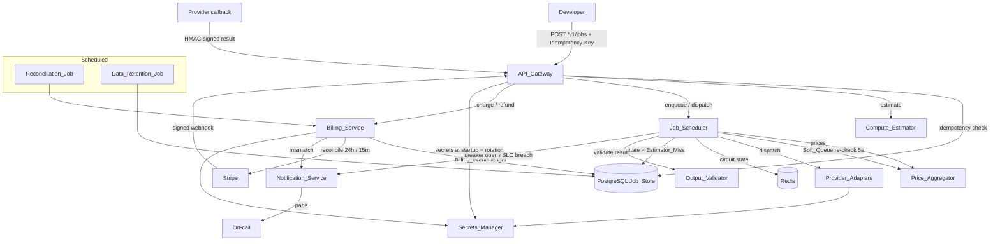

# Design Document: NeuralGrid Production Readiness

## Overview

Production Readiness layers reliability, billing correctness, security, and observability onto the already-shipped MVP (`API_Gateway`, `Compute_Estimator`, `Job_Scheduler`, `Price_Aggregator`) and Stage 2 (`Fireworks_Adapter`, `Job_Executor`, webhooks). The MVP deferred queuing, SLAs, and real-money billing guarantees to ship fast. This design defines what "production" adds so the system keeps routing jobs correctly, keeps billing correctly, and keeps a human informed when it can't — unattended.

**Design principles carried over from the MVP:**
- **Job_Store (PostgreSQL) is the single source of truth.** No service holds Job state only in memory. The Soft_Queue is the one bounded exception (30s, in-memory) and is always reconstructable from `jobs.status = QUEUED`.
- **Microservices with synchronous HTTP** between services; Redis for shared ephemeral state (circuit-breaker counters, rate limits, metrics windows).
- **Append-only ledgers** for anything auditable: `billing_events` and `audit_log` are never mutated in place.
- **Fail visible, not silent.** Every automated recovery path (refund, failover, purge) that exhausts its retries surfaces a durable state (`refund-pending`, `pending-purge`) and pages a human.

**Scope boundary:** This is backend/infra work. Dashboard UI is covered by the `dashboard-redesign` spec and is out of scope here. New service responsibilities introduced: `Billing_Service` and `Notification_Service` (both may be implemented as modules within the existing gateway/scheduler processes initially, but are specified as distinct logical services).

**What's new at a glance:**

| Concern | Mechanism | Primary owner |
|---|---|---|
| Transient capacity gaps | Soft_Queue + one tier-bump | Job_Scheduler |
| Duplicate submissions | Idempotency_Key (per-user, 24h) | API_Gateway |
| Flaky providers | Circuit_Breaker (3 fails/60s → open 5m) | Job_Scheduler |
| Stuck jobs | Job_Timeout (`est_runtime × 3`) + auto-refund | Job_Scheduler + Billing_Service |
| Garbage results | Output_Validator per `job_type` | Job_Scheduler |
| Estimator underestimates | OOM_Retry (bump tier, max 2) | Job_Scheduler |
| Balance drift | `billing_events` ledger + Reconciliation_Job | Billing_Service |
| Post-charge failures | Synchronous auto-refund | Billing_Service |
| Cost/margin disputes | Provider-cost + margin line items | Billing_Service |
| Credential exposure | API-key hashing, Secrets_Manager | API_Gateway / infra |
| Forged callbacks | Signature + replay-window verification | API_Gateway |
| PII minimization | Data_Retention_Job (30-day purge) | API_Gateway |
| Blind operation | Structured logs, metrics, tracing, alerting | all services + Notification_Service |
| Unproven changes | CI gates (unit/contract/load/chaos) | CI_Pipeline |
| Premature scale | Go_Live_Checklist gate | API_Gateway |

## Architecture



**Request path for `POST /jobs` (production):**

```mermaid
sequenceDiagram
    participant D as Developer
    participant GW as API_Gateway
    participant PG as Job_Store
    participant JS as Job_Scheduler
    participant PA as Price_Aggregator
    participant BS as Billing_Service

    D->>GW: POST /jobs (Idempotency-Key, body)
    GW->>GW: validate key present/length; validate input caps; go-live gate
    GW->>PG: lookup (user_id, idempotency_key)
    alt key seen, terminal, body identical
        GW-->>D: cached response (no new job, no charge)
    else key seen, non-terminal
        GW-->>D: 409 IDEMPOTENCY_IN_PROGRESS
    else key seen, body differs
        GW-->>D: 409 IDEMPOTENCY_CONFLICT
    else new key
        GW->>CE: estimate tier
        GW->>PG: insert job (unique user_id+idempotency_key)
        GW->>JS: enqueue
        JS->>PA: node at tier?
        alt node available
            JS->>JS: dispatch, start Job_Timeout
        else none
            JS->>JS: Soft_Queue (≤30s, re-check 5s) → tier-bump → FAIL NO_NODE_AVAILABLE
        end
        GW-->>D: job accepted
    end
```

**State ownership:**
- **Durable (PostgreSQL):** all Job rows, `billing_events`, `invoices`, `audit_log`, `estimator_registry`, `providers`, `provider_nodes`, idempotency associations, traces.
- **Ephemeral (Redis):** circuit-breaker rolling failure counts + open timers, rolling-window metric counters, rate-limit buckets, in-progress idempotency locks. All are reconstructable or safe to lose (worst case: a breaker re-learns, a metric window resets).
- **In-memory (bounded):** Soft_Queue membership and the FIFO queue-wait anchor ordering. Backed by `jobs.status = QUEUED` + `queued_at` so a scheduler restart rebuilds it.

## Components and Interfaces

### API_Gateway (production additions)

Adds: idempotency enforcement, input-cap validation, admin RBAC + session re-auth, signature/replay verification on inbound webhooks/callbacks, distributed-trace initiation, go-live gating.

```typescript
// Idempotency
interface IdempotencyRecord {
  user_id: string;
  idempotency_key: string;      // 1..255 chars, per-user unique
  job_id: string;
  request_hash: string;         // sha256 of canonical request body bytes
  response_snapshot: JobResponse;
  created_at: string;           // association retained 24h
}

type IdempotencyOutcome =
  | { kind: "new" }
  | { kind: "replay"; response: JobResponse }          // terminal + identical body
  | { kind: "conflict" }                               // 409 IDEMPOTENCY_CONFLICT
  | { kind: "in_progress" };                           // 409 IDEMPOTENCY_IN_PROGRESS

// Input caps (per job_type)
interface InputCaps {
  job_type: string;
  max_prompt_chars: number;
  max_image_bytes: number;
  max_output_tokens: number;
}
interface CapViolation { field: string; submitted: number; maximum: number; }

// Signature verification (Stripe webhooks + provider callbacks)
interface SignedInbound {
  raw_body: Buffer;
  signature_header?: string;    // missing => reject
  timestamp: number;            // reject if |now - timestamp| > 300s
}
type VerifyResult = { ok: true } | { ok: false; reason: "missing" | "invalid" | "replay" };

// Admin session
interface AdminSession {
  user_id: string;
  role: "admin";
  last_auth_at: string;         // mutations rejected if age > 12h
}
```

Admin RBAC guard runs server-side on every admin route (403 for non-admin). Admin mutations (POST/PUT/PATCH/DELETE) additionally check `AdminSession` age ≤ 12h, else 401 re-auth-required with no state change.

### Job_Scheduler (production additions)

Owns Soft_Queue, Circuit_Breaker, Job_Timeout, OOM_Retry, Output_Validator invocation, Estimator_Miss recording, structured transition logging, and dispatch metrics.

```typescript
type Tier = "T1" | "T2" | "T3";
const TIER_ORDER: Tier[] = ["T1", "T2", "T3"];

interface SoftQueueEntry {
  job_id: string;
  assigned_tier: Tier;
  queue_wait_anchor: number;    // ms epoch; FIFO ordering key; 30s bound
}

interface CircuitBreakerState {
  provider_id: string;
  failure_timestamps: number[]; // rolling 60s window; open at 3
  state: "closed" | "open";
  opened_at?: number;           // closes after 5 min
}

interface JobTimeout {
  job_id: string;
  dispatched_at: number;
  timeout_ms: number;           // estimated_runtime_ms * 3
}

// Output validation
type JobOutputKind = "text" | "image" | "embeddings";
interface OutputValidator {
  validate(job_type: string, result: Buffer | string): ValidationOutcome;
}
type ValidationOutcome =
  | { valid: true }
  | { valid: false; error_code: "INVALID_OUTPUT" };   // also when no rule defined

// Terminal error codes introduced
type ErrorCode =
  | "NO_NODE_AVAILABLE"
  | "JOB_TIMEOUT"
  | "INVALID_OUTPUT"
  | "OOM_RETRY_EXHAUSTED"
  | "IDEMPOTENCY_CONFLICT"
  | "IDEMPOTENCY_IN_PROGRESS";
```

**Soft_Queue algorithm (Req 1):** On no node at assigned tier → `status=QUEUED`, record `queue_wait_anchor`. Re-check Price_Aggregator every 5s. If a node appears, dispatch and dequeue; when multiple queued jobs contend for one node at the same tier, the earliest `queue_wait_anchor` wins (FIFO). At 30s with no node: if tier is T1/T2, attempt dispatch once at the next tier in `T1→T2→T3`; if that also fails, or tier is already T3, mark `FAILED / NO_NODE_AVAILABLE`.

**Circuit_Breaker (Req 3):** A dispatch failure = error response or dispatch-timeout to any node of a provider. 3 failures in a rolling 60s window → open; exclude that provider's nodes from selection; page on-call. Auto-close 5 min after opening. Any successful dispatch resets the provider's failure count to 0. State in Redis keyed `provider:breaker:{provider_id}`.

**Job_Timeout (Req 4):** At dispatch, `timeout_ms = estimated_runtime_ms × 3` anchored to dispatch time. A monitor marks non-terminal jobs past timeout `FAILED / JOB_TIMEOUT`, records an Estimator_Miss (`TIMEOUT`), and asks Billing_Service to refund iff a `charge` row exists. A late provider result for an already-timed-out job is discarded (status stays `FAILED`).

**OOM_Retry (Req 6):** Provider OOM on a non-T3 job with cumulative OOM count < 2 → redispatch at next tier, increment count, record Estimator_Miss (`OOM`). Count reaches 2, or job already T3 → `FAILED / OOM_RETRY_EXHAUSTED`.

**Output_Validator (Req 5):** Before `COMPLETE`, validate by `job_type` output kind: text → ≥1 non-whitespace char; image → non-empty and matches a known image magic-byte signature (PNG/JPEG/WEBP); embeddings → valid JSON array with ≥1 numeric element. Failure, or no rule defined for the `job_type` → `FAILED / INVALID_OUTPUT`, retaining the original provider result for retrieval.

### Billing_Service

Owns the `billing_events` ledger, balance computation, auto-refund, margin line items, and the two Reconciliation_Job cadences.

```typescript
type BillingEventType = "charge" | "credit" | "topup" | "refund";
interface BillingEvent {
  id: string;
  user_id: string;
  job_id?: string;
  type: BillingEventType;
  amount_usd: number;           // negative for charge; positive for credit/topup/refund
  provider_cost_usd?: number;   // charge line item (Req 10)
  margin_usd?: number;          // charge line item (Req 10)
  created_at: string;
  reconciled_stripe_id?: string;
}

// Balance = sum(amount_usd) over user's events (Req 7.2)
function balance(events: BillingEvent[]): number {
  return events.reduce((s, e) => s + e.amount_usd, 0);
}

interface RefundOutcome {
  status: "refunded" | "no_charge" | "already_credited" | "refund-pending";
}
```

**Auto-refund (Req 9):** On job failure with an uncredited `charge`, synchronously (inside the failure handler, before it returns) create a `credit` equal to the sum of that job's uncredited charges. Idempotent: never double-credit a charge that already has a matching credit. Retry creation up to 3 more times within the same invocation; if all fail, set job `refund-pending` and let the handler complete.

**Margin line items (Req 10):** At charge time, persist `provider_cost_usd` and `margin_usd` as distinct fields on the `charge` event, each to 2 dp. Invariant: `provider_cost + margin == total charged` within 0.01; violation flags the charge inconsistent and preserves the recorded lines unmodified. Margin detail is served directly from stored fields, never recomputed.

**Reconciliation_Job (Req 7, 8):** Two cadences:
- *Ledger balance*, every 24h at a fixed time: compare each user's `sum(billing_events)` vs cached balance; diff ≤ $0.01 is tolerance; larger diff → admin alert naming user + discrepancy, no balance mutation. A user comparison that can't complete → alert + retry next run.
- *Stripe*, every 15 min: compare Stripe charge/topup records from the trailing 24h (excluding records < 5 min old) against `billing_events`. Stripe record with no ledger row → orphan; ledger row with no Stripe record → orphan; amounts differing > $0.01 → mismatch. Stripe API unreachable → admin alert + retry next run. Any mismatch pages on-call (Req 19.3).

### Notification_Service

```typescript
type AlertKind =
  | "breaker_open" | "success_rate_low" | "billing_mismatch"
  | "http_5xx_high" | "breaker_open_prolonged";

interface Page {
  kind: AlertKind;
  dedupe_key: string;           // suppress duplicates while condition active (Req 19.6)
  raised_at: number;
  acknowledged: boolean;        // re-page if unacked after 15 min (Req 19.5)
}
```

Alert triggers (Req 19): success rate < 85% over 15m with ≥20 completions; breaker open > 10 min; any billing mismatch; 5xx rate > 1% over 15m with ≥20 requests. Unacknowledged pages re-page after 15 min. Duplicate pages for a continuously-active condition are suppressed by `dedupe_key`.

### Observability plane

- **Structured logging (Req 17):** each job state transition emits one JSON entry `{job_id, user_id, request_id, from_status, to_status, timestamp}` (ISO 8601 UTC, ms). Emission retries up to 3× and never blocks/rolls back the transition. Exactly one entry per transition (dedupe on `{job_id, from, to, transition_seq}`).
- **Metrics (Req 18):** rolling 5-min throughput, success rate, P50/P95 dispatch latency, per-provider error rate; emitted every 60s (Prometheus). Estimator accuracy from the most recent 100 Estimator_Miss records; `not-available` when < 10 exist.
- **Tracing (Req 20):** one trace per job with spans for submission, estimation, dispatch, result (start+end times). Retrieval by `job_id` returns all spans within 5s; unknown `job_id` → not-found. Traces retained ≥ 30 days post-completion.

### SLO measurement (Req 21)

Targets tracked from month one: API_Gateway ≥ 99.5% availability (non-5xx / total, per UTC calendar month); Job_Scheduler P50 dispatch latency < 800 ms; job success rate ≥ 90%. Price_Aggregator enforces 90s max cache staleness — prices older than 90s are excluded, and if none younger than 90s exists for a tier, it returns an error rather than serving stale.

### Secrets_Manager integration (Req 12)

Production retrieves provider keys, Stripe keys, and DB credentials from a Secrets_Manager (no plaintext env fallback in prod). Provider API keys rotate without a deploy, effective within 5 min (short-TTL cached fetch). Missing required credential at startup → fail startup, log the missing credential name only (never a partial value).

### CI_Pipeline gates (Req 22–25)

- **Unit (Req 22):** estimator VRAM/tier per quantization (fp32/fp16/int8/int4) × confidence branch; node-scoring lowest-score selection incl. ties and AMD bonus; cost calc margin + RunPod A100 baseline incl. zero/negative savings. Any failure or < 90% line coverage on estimator/scoring/cost modules blocks deploy.
- **Contract (Req 23):** every registered Provider_Adapter tested against a recorded fixture (status + body schema) on every build; missing fixture fails the build; failure reports adapter + assertion.
- **Load (Req 24):** before first prod deploy, 500 concurrent submissions in 60s, each retried up to 3× (retry storm); assert exactly 500 charges (zero duplicates) and P95 dispatch ≤ 2000 ms, else block + report.
- **Chaos (Req 25):** kill a provider mid-Running; within 60s observe breaker open + failover dispatch + full refund; refund must equal accrued cost at kill; must complete within 120s else treated as failed.

### Go_Live_Checklist gate (Req 28)

Until an authorized operator marks all 12 checklist items complete, only the original 10 beta accounts may submit jobs or sign up; others get a go-live-pending error with no account/job created. Completing the final item lifts the restriction; marking any item incomplete later re-imposes it.

## Data Models

### `jobs` table extensions (Req 26.1, 26.3)

```sql
ALTER TABLE jobs
  ADD COLUMN idempotency_key       TEXT,
  ADD COLUMN error_code            TEXT,
  ADD COLUMN tier_assigned         TEXT NOT NULL,
  ADD COLUMN confidence            TEXT,
  ADD COLUMN vram_estimate_gb      NUMERIC,
  ADD COLUMN provider_id           UUID REFERENCES providers(id),
  ADD COLUMN node_id               UUID REFERENCES provider_nodes(id),
  ADD COLUMN cost_usd              NUMERIC,
  ADD COLUMN baseline_a100_cost_usd NUMERIC,
  ADD COLUMN runtime_ms            INTEGER,
  ADD COLUMN retry_count           INTEGER NOT NULL DEFAULT 0,
  ADD COLUMN oom_retry_count       INTEGER NOT NULL DEFAULT 0,
  ADD COLUMN queued_at             TIMESTAMPTZ,          -- Soft_Queue anchor persistence
  ADD COLUMN dispatched_at         TIMESTAMPTZ,          -- Job_Timeout anchor
  ADD COLUMN retention_purged_at   TIMESTAMPTZ;          -- Data_Retention_Job

-- Idempotency uniqueness per user (Req 26.3)
ALTER TABLE jobs
  ADD CONSTRAINT uq_jobs_user_idempotency UNIQUE (user_id, idempotency_key);
```

`status` domain extended with terminal `refund-pending` handling recorded via `error_code` + a `refund_state` flag; job status enum: `QUEUED | DISPATCHED | RUNNING | COMPLETE | FAILED`.

### New tables (Req 26.2)

```sql
CREATE TABLE providers (
  id            UUID PRIMARY KEY,
  name          TEXT NOT NULL UNIQUE,          -- 'vastai' | 'runpod' | ...
  enabled       BOOLEAN NOT NULL DEFAULT true,
  created_at    TIMESTAMPTZ NOT NULL DEFAULT now()
);

CREATE TABLE provider_nodes (
  id            UUID PRIMARY KEY,
  provider_id   UUID NOT NULL REFERENCES providers(id),
  gpu_model     TEXT NOT NULL,
  tier          TEXT NOT NULL,                 -- T1|T2|T3
  vram_gb       NUMERIC NOT NULL,
  hourly_rate_usd NUMERIC NOT NULL,
  availability  BOOLEAN NOT NULL DEFAULT false,
  updated_at    TIMESTAMPTZ NOT NULL DEFAULT now()
);

-- Append-only ledger (Req 7, 9, 10)
CREATE TABLE billing_events (
  id                UUID PRIMARY KEY,
  user_id           UUID NOT NULL REFERENCES users(id),
  job_id            UUID REFERENCES jobs(id),
  type              TEXT NOT NULL CHECK (type IN ('charge','credit','topup','refund')),
  amount_usd        NUMERIC NOT NULL,          -- charge<0; credit/topup/refund>0
  provider_cost_usd NUMERIC,                    -- charge line item
  margin_usd        NUMERIC,                    -- charge line item
  charge_consistent BOOLEAN,                    -- false => flagged (Req 10.3)
  credit_of_event   UUID REFERENCES billing_events(id),  -- links credit->charge (Req 9.3)
  reconciled_stripe_id TEXT,
  created_at        TIMESTAMPTZ NOT NULL DEFAULT now()
);
-- enforced append-only via trigger rejecting UPDATE/DELETE

CREATE TABLE invoices (
  id            UUID PRIMARY KEY,
  user_id       UUID NOT NULL REFERENCES users(id),
  period_start  TIMESTAMPTZ NOT NULL,
  period_end    TIMESTAMPTZ NOT NULL,
  total_usd     NUMERIC NOT NULL,
  created_at    TIMESTAMPTZ NOT NULL DEFAULT now()
);

CREATE TABLE estimator_registry (
  id            UUID PRIMARY KEY,
  job_type      TEXT NOT NULL,
  cause         TEXT CHECK (cause IN ('TIMEOUT','OOM')),  -- Estimator_Miss_Record
  job_id        UUID REFERENCES jobs(id),
  created_at    TIMESTAMPTZ NOT NULL DEFAULT now()
);

-- Append-only (Req 27)
CREATE TABLE audit_log (
  id            UUID PRIMARY KEY,
  actor_id      TEXT NOT NULL,
  action_type   TEXT NOT NULL,                 -- credit_grant|refund|key_revoke|...
  target_id     TEXT NOT NULL,
  outcome       TEXT NOT NULL CHECK (outcome IN ('success','failure')),
  created_at    TIMESTAMPTZ NOT NULL DEFAULT now()
);
-- enforced append-only via trigger rejecting UPDATE/DELETE (Req 27.2, 27.4)
```

### API keys (Req 11)

`api_keys.key_hash` stores `sha256(key)`; plaintext is never persisted. Full plaintext returned exactly once (creation response); all later views show first-8 + last-4 masked. If `key_hash` fails to persist, the creation response omits plaintext and returns a key-creation-failed error.

### Idempotency store

The `(user_id, idempotency_key)` association plus `request_hash` and a cached `response_snapshot` live keyed on the `jobs` row (24h association window). An in-progress Redis lock keyed `idem:{user_id}:{key}` covers the window between insert and terminal status to answer `IDEMPOTENCY_IN_PROGRESS` even before the row commits.

## Correctness Properties

*A property is a characteristic or behavior that should hold true across all valid executions of a system — essentially, a formal statement about what the system should do. Properties serve as the bridge between human-readable specifications and machine-verifiable correctness guarantees.*

These properties were derived from the acceptance-criteria prework and consolidated to remove redundancy. Each maps to a `fast-check` property-based test (min 100 iterations). Criteria that are timing boundaries, one-shot config/setup, CI-gate wiring, external-service integration, or notification side-effects are covered by unit, edge-case, integration, or smoke tests in the Testing Strategy rather than by properties here.

### Property 1: No node yields a bounded, FIFO-ordered Soft_Queue entry

*For any* job and any node-availability state in which no node exists at the job's assigned tier, the Job_Scheduler SHALL set the job's status to QUEUED and record a queue-wait anchor; and *for any* set of jobs queued at the same tier contending for a single newly available node, the job with the earliest queue-wait anchor SHALL be the one dispatched (and then removed from the queue).

**Validates: Requirements 1.1, 1.4, 1.8**

### Property 2: Tier-bump then failure ladder

*For any* queued job on tier T1 or T2 whose 30s wait elapses with no node at its assigned tier, the Job_Scheduler SHALL make exactly one dispatch attempt at the next tier in the fixed order T1→T2→T3; and if that attempt also finds no node, the job SHALL end FAILED with error_code `NO_NODE_AVAILABLE`.

**Validates: Requirements 1.5, 1.6**

### Property 3: New idempotency key creates exactly one job with a stored association

*For any* fresh (never-seen-for-that-user) Idempotency_Key and request body, the API_Gateway SHALL create exactly one job and persist the key→job association.

**Validates: Requirements 2.3**

### Property 4: Idempotent replay creates no new job and no new charge

*For any* Idempotency_Key whose prior job has reached a terminal status, a resubmission with a byte-for-byte identical body SHALL return the cached response while leaving the job count and the charge count for that user unchanged.

**Validates: Requirements 2.4**

### Property 5: Idempotency conflict and in-progress handling

*For any* previously-seen Idempotency_Key, a resubmission whose body differs from the original SHALL return 409 `IDEMPOTENCY_CONFLICT`, and a resubmission while the original job is still non-terminal SHALL return 409 `IDEMPOTENCY_IN_PROGRESS` without creating a new job.

**Validates: Requirements 2.5, 2.6**

### Property 6: Idempotency keys are isolated per user

*For any* two distinct users submitting the same Idempotency_Key value, the two submissions SHALL be treated as independent keys (each creating its own job, with no cross-user collision).

**Validates: Requirements 2.7, 26.3, 26.4**

### Property 7: Circuit breaker opens on 3 failures in a rolling 60s window

*For any* sequence of dispatch outcomes for a provider, the Circuit_Breaker SHALL be open if and only if at least 3 failures occurred within some rolling 60-second window with no intervening success reset.

**Validates: Requirements 3.1**

### Property 8: An open breaker excludes the provider; success resets the count

*For any* node-selection performed while a provider's breaker is open, no node belonging to that provider SHALL be selected; and *for any* provider with a failure count below 3, a successful dispatch SHALL reset that count to 0.

**Validates: Requirements 3.2, 3.5**

### Property 9: Job_Timeout equals estimated runtime times three

*For any* dispatched job, its Job_Timeout SHALL equal its `estimated_runtime × 3`, anchored to the dispatch timestamp.

**Validates: Requirements 4.1**

### Property 10: A timed-out job fails terminally and stays failed

*For any* dispatched job that is still non-terminal when its Job_Timeout elapses, the Job_Scheduler SHALL mark it FAILED with error_code `JOB_TIMEOUT`; and *for any* provider result delivered after that point, the job's status SHALL remain FAILED.

**Validates: Requirements 4.2, 4.6**

### Property 11: Timeout refund is conditioned on an existing charge

*For any* job failed with `JOB_TIMEOUT`, the Billing_Service SHALL create a refunding credit if and only if a `charge` billing_events row exists for that job.

**Validates: Requirements 4.3, 4.4**

### Property 12: Estimator_Miss is recorded with the correct cause

*For any* job that is failed by timeout, an Estimator_Miss_Record with cause `TIMEOUT` SHALL be recorded; and *for any* job that undergoes an OOM_Retry, an Estimator_Miss_Record with cause `OOM` SHALL be recorded.

**Validates: Requirements 4.5, 6.5**

### Property 13: Output validation gates completion by output kind

*For any* provider result: a text-output job SHALL be marked COMPLETE if and only if the result contains at least one non-whitespace character; an image-output job if and only if the content is non-empty and begins with a recognized image-format signature; an embeddings-output job if and only if the content parses as a JSON array containing at least one numeric value. In every failing case the job SHALL be marked FAILED with error_code `INVALID_OUTPUT` and the original provider result SHALL be retained.

**Validates: Requirements 5.1, 5.2, 5.3, 5.4, 5.5**

### Property 14: OOM_Retry lifecycle bumps tier, caps at 2, then exhausts

*For any* job receiving OOM events: while the job is below tier T3 and its cumulative OOM count is below 2, the Job_Scheduler SHALL redispatch at the next tier in T1→T2→T3 and increment the count; the cumulative OOM count SHALL never exceed 2; and any OOM event once the count has reached 2 SHALL mark the job FAILED with error_code `OOM_RETRY_EXHAUSTED`.

**Validates: Requirements 6.1, 6.2, 6.3**

### Property 15: Ledger sign convention and balance-as-sum

*For any* billing event, `amount_usd` SHALL be negative when the type is `charge` and positive when the type is `credit`, `topup`, or `refund`; and *for any* sequence of a user's billing events, the computed balance SHALL equal the sum of their `amount_usd` values.

**Validates: Requirements 7.1, 7.2**

### Property 16: Ledger reconciliation flags and alerts only beyond tolerance, without mutation

*For any* pair of computed and cached balances for a user, the ledger Reconciliation_Job SHALL flag a mismatch and raise an admin alert if and only if the absolute difference exceeds $0.01, and in all cases SHALL leave both balance values unmodified.

**Validates: Requirements 7.3, 7.4**

### Property 17: Stripe reconciliation orphan and mismatch detection

*For any* set of Stripe records and billing_events rows (each at least 5 minutes old, within the trailing 24 hours): a record present on one side with no counterpart on the other SHALL be flagged as an orphan, and a matched pair whose amounts differ by more than $0.01 SHALL be flagged as a mismatch.

**Validates: Requirements 8.2, 8.3, 8.4**

### Property 18: Auto-refund credits exactly the uncredited charges, idempotently

*For any* job that fails after being charged, the Billing_Service SHALL create a single `credit` whose amount equals the sum of that job's charges that do not already have a corresponding credit; and repeating the refund operation SHALL NOT create a duplicate credit for a charge already credited.

**Validates: Requirements 9.1, 9.3**

### Property 19: Charge records provider-cost and margin as summing line items

*For any* charge for a completed job, the Billing_Service SHALL persist a provider-cost line and a margin line, each to 2 decimal places, whose sum equals the total charged amount within 0.01; if the sum does not match within 0.01, the charge SHALL be flagged inconsistent and both recorded lines SHALL be preserved unmodified.

**Validates: Requirements 10.1, 10.2, 10.3**

### Property 20: Margin detail is served from stored records without recomputation

*For any* charged job, a request for its margin detail SHALL return the provider-cost line and margin line exactly as stored (a round-trip of the persisted values), with no recomputation of either.

**Validates: Requirements 10.4**

### Property 21: API keys are stored hashed and masked on later views

*For any* generated API key, the API_Gateway SHALL store `sha256(key)` in `key_hash`, SHALL NOT persist the plaintext anywhere, and *for any* view after creation SHALL display only the key's first 8 and last 4 characters with the remainder masked.

**Validates: Requirements 11.1, 11.3**

### Property 22: Admin RBAC is enforced server-side

*For any* request to an admin route by a user whose role is not admin, the API_Gateway SHALL return 403 and SHALL NOT process the request; only requests from users whose role is admin SHALL proceed.

**Validates: Requirements 13.1, 13.2**

### Property 23: Inbound signature verification admits only authentic, in-window requests

*For any* inbound Stripe webhook or provider callback, the API_Gateway SHALL process it if and only if its signature verifies against the correct secret, a signature header is present, and its timestamp is within 300 seconds of current time; otherwise it SHALL be rejected with a response that does not reveal secret or verification details.

**Validates: Requirements 14.1, 14.2, 14.3, 14.4, 14.5, 14.6**

### Property 24: Rejected inbound requests leave all prior state unchanged

*For any* inbound Stripe webhook or provider callback that is rejected (bad signature, unsigned, or replay), all prior Job and billing state SHALL remain unchanged.

**Validates: Requirements 14.7**

### Property 25: Data retention purges only old, non-opted-in inputs and preserves other fields

*For any* set of jobs, the Data_Retention_Job SHALL purge (render unretrievable) the `input_ref` content of exactly those jobs older than 30 days whose owner has not opted into extended retention, while leaving each job's cost, status, and timestamp fields intact and unchanged.

**Validates: Requirements 15.1, 15.2, 15.3**

### Property 26: Input-cap validation reports every offending field with its cap

*For any* job submission, the API_Gateway SHALL return a 400 if and only if at least one of prompt length, image size, or output tokens exceeds its configured cap for the `job_type`, and the error SHALL name every field that exceeded its cap along with the submitted value and the configured maximum.

**Validates: Requirements 16.1**

### Property 27: Cap configuration is rejected when it permits a job above the cost cap

*For any* proposed input-cap configuration for a `job_type`, the API_Gateway SHALL reject it if and only if the `estimated_cost_usd` computed from that configuration's capped-maximum values exceeds `max_job_cost_cap` ($5.00).

**Validates: Requirements 16.3**

### Property 28: Each job state transition emits exactly one well-formed structured log entry

*For any* sequence of job state transitions, the Job_Scheduler SHALL emit exactly one JSON log entry per transition (no duplicates, no omissions), each containing `job_id`, `user_id`, `request_id`, `from_status`, `to_status`, and an ISO 8601 UTC millisecond-precision `timestamp`.

**Validates: Requirements 17.1, 17.3**

### Property 29: Dispatch and provider metrics match reference computation over the rolling window

*For any* stream of dispatch outcomes and latencies, the throughput, success rate, P50 and P95 dispatch latency (overall) and per-provider error rate SHALL equal a reference computation over the rolling 5-minute window.

**Validates: Requirements 18.1, 18.3**

### Property 30: Estimator accuracy uses the most recent 100 miss records

*For any* set of at least 10 Estimator_Miss_Records, the estimator accuracy metric SHALL be derived from the most recent 100 records (or all records if fewer than 100 exist).

**Validates: Requirements 18.4**

### Property 31: Threshold breach with minimum-volume guard pages on-call

*For any* trailing 15-minute window, the Notification_Service SHALL page on-call for low success rate if and only if the success rate is below 85% and at least 20 jobs completed; and SHALL page for high error rate if and only if the 5xx rate exceeds 1% and at least 20 requests occurred.

**Validates: Requirements 19.1, 19.4**

### Property 32: Duplicate pages are suppressed while a condition stays active

*For any* breach condition that remains continuously active, the Notification_Service SHALL emit at most one page for that condition (by dedupe key) until the condition clears.

**Validates: Requirements 19.6**

### Property 33: Price cache excludes stale prices

*For any* set of cached prices for a tier, the Price_Aggregator SHALL serve only prices younger than 90 seconds and SHALL exclude any price 90 seconds or older.

**Validates: Requirements 21.4**

### Property 34: Audit log is complete and append-only

*For any* admin action that modifies user data, the Audit_Log SHALL record a row containing an ISO 8601 UTC timestamp, actor identifier, action type, target identifier, and outcome (`success` for a completed action, `failure` for a failed one); and *for any* attempt to modify or delete an existing audit row, the system SHALL reject it and preserve the original row unchanged.

**Validates: Requirements 27.1, 27.2, 27.3, 27.4**

### Property 35: Go-live gate reversibly restricts non-beta accounts

*For any* account outside the original 10 beta developers, while any Go_Live_Checklist item is incomplete a `POST /jobs` or signup SHALL be rejected with a go-live-pending error and SHALL create no job or account; the restriction SHALL be lifted only when all items are complete and SHALL be restored if any item later becomes incomplete.

**Validates: Requirements 28.1, 28.4, 28.5**

## Error Handling

### Error response format

Reuses the MVP envelope:

```json
{ "error": { "code": "ERROR_CODE", "message": "Human-readable description", "details": {} } }
```

### New error codes and HTTP mapping

| Code | HTTP | Trigger |
|---|---|---|
| `MISSING_IDEMPOTENCY_KEY` | 400 | `Idempotency-Key` header absent (Req 2.1) |
| `INVALID_IDEMPOTENCY_KEY` | 400 | Key empty or > 255 chars (Req 2.2) |
| `IDEMPOTENCY_CONFLICT` | 409 | Seen key, body differs (Req 2.5) |
| `IDEMPOTENCY_IN_PROGRESS` | 409 | Seen key, prior job non-terminal (Req 2.6) |
| `NO_NODE_AVAILABLE` | (job error_code) | Soft_Queue + tier-bump exhausted (Req 1.6, 1.7) |
| `JOB_TIMEOUT` | (job error_code) | Non-terminal past `est_runtime×3` (Req 4.2) |
| `INVALID_OUTPUT` | (job error_code) | Output validation failed / no rule (Req 5.5, 5.6) |
| `OOM_RETRY_EXHAUSTED` | (job error_code) | OOM after 2 retries or at T3 (Req 6.3, 6.4) |
| `INPUT_CAP_EXCEEDED` | 400 | Field(s) over cap; lists each field (Req 16.1) |
| `NO_CAPS_CONFIGURED` | 400 | `job_type` has no configured caps (Req 16.2) |
| `ADMIN_FORBIDDEN` | 403 | Non-admin on admin route (Req 13.2) |
| `REAUTH_REQUIRED` | 401 | Admin mutation, session age > 12h (Req 13.3) |
| `SIGNATURE_INVALID` | 400/401 | Webhook/callback rejected; details withheld (Req 14) |
| `GO_LIVE_PENDING` | 403 | Non-beta account while checklist incomplete (Req 28.4) |
| `PRICE_STALE` | 503 | No price younger than 90s for tier (Req 21.5) |

### Failure-path (fail-visible) behaviors

- **Refund exhaustion (Req 9.5):** after 4 total attempts, job → `refund-pending`; handler completes; surfaced to reconciliation + admin alert.
- **Structured log emission failure (Req 17.2):** retry ≤ 3×; never block or roll back the transition.
- **Purge failure (Req 15.4):** job → `pending-purge`; retried next scheduled run.
- **Reconciliation incompletion / Stripe unreachable (Req 7.5, 8.5):** admin alert + retry next run; no balance mutation.
- **Secrets_Manager missing credential at startup (Req 12.3):** fail startup; log credential name only.
- **Charge inconsistency (Req 10.3):** flag charge inconsistent; preserve recorded line items.
- **Rejected inbound (Req 14.7):** all prior Job and billing state left unchanged.

### Concurrency and idempotency safety

- `POST /jobs` idempotency uses the `UNIQUE(user_id, idempotency_key)` constraint as the arbiter: on a race, the losing insert's constraint violation is caught and resolved as an existing-key match (replay / conflict / in-progress per Req 2). A Redis `idem:{user}:{key}` lock answers `IDEMPOTENCY_IN_PROGRESS` before the row commits.
- Terminal job states are monotonic: a `FAILED`/`COMPLETE` job never transitions again, so late provider results and duplicate callbacks are no-ops (Req 4.6).
- `billing_events` and `audit_log` are append-only via DB triggers rejecting `UPDATE`/`DELETE`.

## Testing Strategy

### Dual approach

- **Property-based tests** verify the 35 universal properties above across generated inputs.
- **Unit / edge-case tests** verify specific examples, boundaries, and error messages.
- **Integration tests** verify external-service wiring and end-to-end flows.
- **Smoke tests** verify one-shot configuration and gate wiring.

### Property-based testing

**Library:** [fast-check](https://github.com/dubzzz/fast-check) (TypeScript/Node.js), matching the MVP. Property-based testing is appropriate here because the reliability and billing logic are pure/deterministic given their inputs (queue ordering, breaker windows, timeout math, ledger sums, validators, gating), with large input spaces that benefit from randomized coverage. External services (Stripe, provider APIs, Secrets_Manager) are mocked so property tests exercise our logic, not third-party behavior.

**Configuration:**
- Minimum 100 iterations per property.
- Each test tagged: `Feature: production-readiness, Property {N}: {title}`.
- One property-based test per correctness property.

**Generators:**
- Node-availability maps across tiers (empty, partial, full) and provider ownership.
- Sets of queued jobs with random queue-wait anchors (for FIFO ordering).
- Dispatch outcome sequences with timestamps (for breaker windows and metrics).
- Random `estimated_runtime` values (for timeout math).
- Result payloads per output kind: text (incl. whitespace-only, unicode), image bytes (valid PNG/JPEG/WEBP magic and random/empty buffers), embeddings (valid/invalid JSON, empty and non-numeric arrays).
- Billing event sequences across all four types with random amounts (for sign/sum invariants and refund/margin math).
- Stripe-vs-ledger record sets with controlled ages and amount deltas.
- API key strings (for hashing/masking), user roles (admin/non-admin), signed inbound payloads with tampered/absent signatures and skewed timestamps.
- Input submissions crossing random subsets of caps; cap configurations spanning above/below the $5.00 cost cap.
- Job sets with random creation ages and extended-retention opt-in flags.
- Accounts inside/outside the beta set with checklists in complete/incomplete states.

**Property → focus mapping:**
- Properties 1–2, 7–10, 14: Job_Scheduler reliability logic (queue, breaker, timeout, OOM) with a controllable clock.
- Properties 3–6: idempotency (gateway + `UNIQUE(user_id, idempotency_key)`).
- Properties 11–12, 15–20: Billing_Service (refund, ledger sum, reconciliation, margin).
- Property 13: Output_Validator.
- Properties 21–24: security (key hashing/masking, RBAC, signature/replay, non-mutation).
- Properties 25–27: retention, input caps, cap-cost config.
- Properties 28–33: observability (logging, metrics, estimator accuracy, paging, price freshness).
- Properties 34–35: audit-log immutability and go-live gating.

### Unit and edge-case tests

- Idempotency header validation: missing (2.1), empty / 1-char / 255-char / 256-char (2.2).
- Soft_Queue timing: 5s re-check cadence (1.2), 30s bound at 29.9/30/30.1s (1.3), T3 no-bump (1.7).
- Breaker close at exactly 5 min (3.4); open-provider alert content (3.3).
- Output validator missing-rule fail-closed (5.6); OOM at T3 (6.4).
- Reconciliation windowing: record ages around 5 min and 24 h (8.1); `<10` miss records → not-available (18.5).
- Admin session boundary at 12 h (13.3); re-auth success/failure (13.4, 13.5).
- Unsigned and replay-window boundaries at ±300 s (14.5, 14.6).
- Paging timers: breaker-open > 10 min (19.2), unacked re-page at 15 min (19.5), billing-mismatch page (19.3).
- Price staleness: no fresh price → error (21.5).
- API-key single-exposure (11.2), no-plaintext-in-logs scan (11.4), persist-failure path (11.5).
- Refund failure paths: synchronous ordering (9.2), retry count (9.4), refund-pending (9.5).
- Purge failure → pending-purge (15.4); structured-log emission retry without rollback (17.2).
- Trace structure (20.1), unknown-`job_id` not-found (20.4).

### Integration tests

- Secrets_Manager: provider-key rotation effective within 5 min without deploy (12.2).
- Distributed trace retrieval returns all spans within 5 s (20.3).
- Provider adapter contract tests vs recorded fixtures — every adapter, every build; missing fixture fails build (Req 23).
- Load-test gate: 500 concurrent submissions in 60 s with up to 3 retries each; assert exactly 500 charges (zero duplicates) and P95 dispatch ≤ 2000 ms (Req 24). This is the end-to-end confirmation of the idempotency properties (4, 6) under load.
- Chaos-test gate: kill provider mid-Running; within 60 s observe breaker open + failover + full refund; refund equals accrued cost; complete within 120 s (Req 25).

### Smoke tests

- Schema migrations: `jobs` columns and new tables/FKs exist with correct types (26.1, 26.2).
- Secrets sourced from Secrets_Manager with no plaintext env fallback in prod (12.1); missing-credential startup failure logs name only (12.3).
- Trace retention ≥ 30 days (20.5).
- SLO wiring: availability (21.1), P50 dispatch < 800 ms (21.2), success rate ≥ 90% (21.3) tracked against targets.
- CI gate wiring: unit suites for estimator/scoring/cost exist and run (22.1–22.3); pipeline blocks on failure (22.4) and on < 90% coverage of core modules (22.5).
- Go_Live_Checklist contains the 12 named items (28.2); completing the final item lifts the restriction (28.3).
